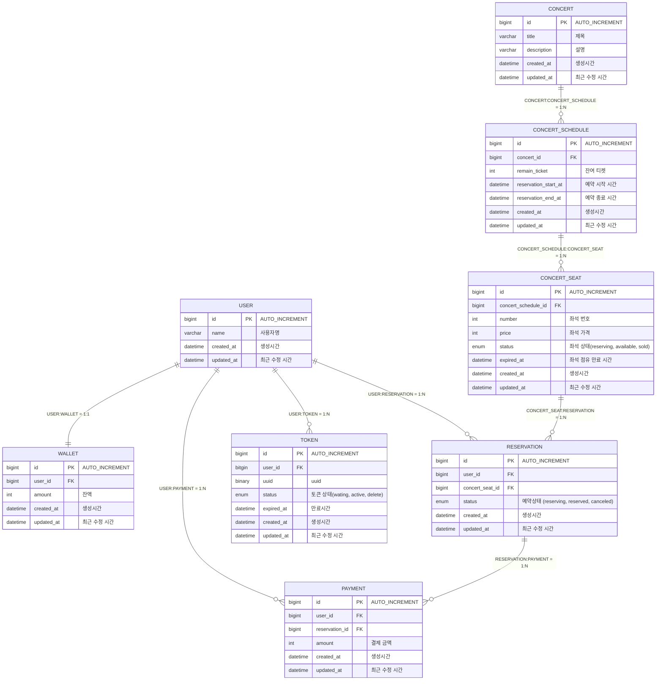

### 콘서트 예약 서비스 ERD

```mermaid
erDiagram
    USER {
        bigint id PK "AUTO_INCREMENT"
        varchar name "사용자명"
        datetime created_at "생성시간"
        datetime updated_at "최근 수정 시간"
    }

    WALLET {
        bigint id PK "AUTO_INCREMENT"
        bigint user_id FK
        int amount "잔액"
        datetime created_at "생성시간"
        datetime updated_at "최근 수정 시간"
    }

    PAYMENT {
        bigint id PK "AUTO_INCREMENT"
        bigint user_id FK
        bigint reservation_id FK
        int amount "결제 금액"
        datetime created_at "생성시간"
        datetime updated_at "최근 수정 시간"
    }

    RESERVATION {
        bigint id PK "AUTO_INCREMENT"
        bigint user_id FK
        bigint concert_seat_id FK
        enum status "예약상태 (reserving, reserved, canceled)"
        datetime created_at "생성시간"
        datetime updated_at "최근 수정 시간"
    }

    CONCERT {
        bigint id PK "AUTO_INCREMENT"
        varchar title "제목" 
        varchar description "설명"
        datetime created_at "생성시간"
        datetime updated_at "최근 수정 시간"
    }

    CONCERT_SCHEDULE {
        bigint id PK "AUTO_INCREMENT"
        bigint concert_id FK
        int remain_ticket "잔여 티켓"
        datetime reservation_start_at "예약 시작 시간"
        datetime reservation_end_at "예약 종료 시간"
        datetime created_at "생성시간"
        datetime updated_at "최근 수정 시간"
    }

    CONCERT_SEAT {
        bigint id PK "AUTO_INCREMENT"
        bigint concert_schedule_id FK
        int number "좌석 번호"
        int price "좌석 가격"
        enum status "좌석 상태(reserving, available, sold)"
        datetime expired_at "좌석 점유 만료 시간"
        datetime created_at "생성시간"
        datetime updated_at "최근 수정 시간"
    }

    TOKEN {
        bigint id PK "AUTO_INCREMENT"
        bitgin user_id FK
        binary uuid "uuid"
        enum status "토큰 상태(wating, active, delete)"
        datetime expired_at "만료시간"
        datetime created_at "생성시간"
        datetime updated_at "최근 수정 시간"
    }

    USER ||--|| WALLET: "USER:WALLET = 1:1"
    USER ||--o{ RESERVATION: "USER:RESERVATION = 1:N"
    USER ||--o{ PAYMENT: "USER:PAYMENT = 1:N"
    CONCERT ||--o{ CONCERT_SCHEDULE: "CONCERT:CONCERT_SCHEDULE = 1:N"
    CONCERT_SCHEDULE ||--o{ CONCERT_SEAT: "CONCERT_SCHEDULE:CONCERT_SEAT = 1:N"
    CONCERT_SEAT ||--o{ RESERVATION: "CONCERT_SEAT:RESERVATION = 1:N"
    RESERVATION ||--o{ PAYMENT: "RESERVATION:PAYMENT = 1:N"
    USER ||--o{ TOKEN: "USER:TOKEN = 1:N"

```