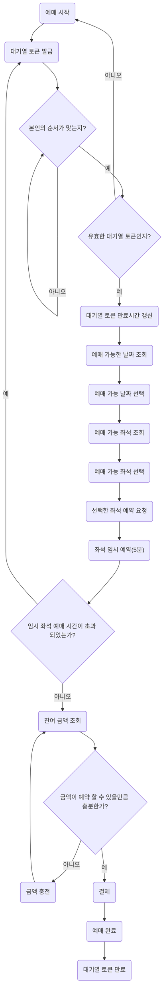

### FLOWCHART

## 콘서트 예약 서비스 FlowChart

```mermaid
flowchart TD
    A("예매 시작") --> B("대기열 토큰 발급")  --> D{"본인의 순서가 맞는지?"}
    D -- 아니오 --> D
    D -- 예 --> C{"유효한 대기열 토큰인지?"} 
    C -- 아니오 --> A
    C -- 예 --> CC("대기열 토큰 만료시간 갱신") --> E("예매 가능한 날짜 조회")
    E --> F("예매 가능 날짜 선택") --> H("예매 가능 좌석 조회")
    H --> I("예매 가능 좌석 선택")
    I --> J("선택한 좌석 예약 요청")
    J --> K("좌석 임시 예약(5분)")
    K --> KD{"임시 좌석 예매 시간이 초과 되었는가?"}
    KD -- 예 --> B
    KD -- 아니오 --> L("잔여 금액 조회")
    L --> M{"금액이 예약 할 수 있을만큼 충분한가?"}
    M -- 아니오 --> ML("금액 충전") --> L
    M -- 예 --> N("결제") --> P("예매 완료")
    --> Q("대기열 토큰 만료")
```