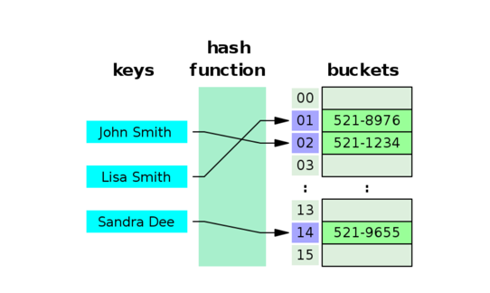
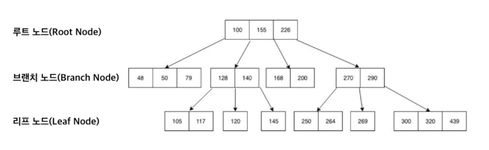
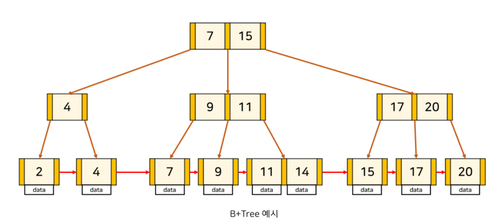

# DB Query Optimization (feat. Index)

---

## 들어가면서

먼저 들어가기 앞서 한 대규모 전자상거래 서비스가 있고 하루에 적으면 수천에서 많으면 수만명의 고객이 상품을 검색하고 구매한다고 가정해보자.
고객들은 가격대나 카테고리등으로 다양한 상품들을 검색할텐데 인덱스 설정이 안되어 있다면 아마 테이블의 모든 데이터를 하나하나 찾아야 할 것이다.
이 과정은 수백만 개의 레코드를 스캔해야 하므로, 검색 결과를 반환하는 데 오래 걸리면 몇 분까지 걸릴 수 있다.
그렇게 된다면 고객들은 느린 검색 속도에 불만을 느끼고, 결국 서비스를 더이상 이용하지 않을 것이다.
하지만 가격대나 카테고리등 인덱스가 생성되어 있다면, 데이터베이스는 인덱스를 통해 해당 키워드와 관련된 상품을 빠르게 찾아낼 수 있으며
고객들은 원활하게 서비스를 이용할 수 있다.

이처럼 인덱스는 대량의 데이터 속에서 필요한 정보를 신속하게 찾을 수 있도록 도와주며, 사용자 경험을 개선하고 조회 성능 향상에 중요한 역할을 한다.

---

## 인덱스란?

- 인덱스(index)는 추가적인 쓰기 작업과 저장 공간을 활용하여 데이터베이스 테이블에 저장된 데이터의 검색 속도를 향상시키기 위한 자료구조이다.
- DB 내의 특정 컬럼(열) 및 컬럼들의 조합에 대한 값과 해당 값이 저장된 레코드(행)의 위치를 매핑하여 전체 데이터를 스캔(Full Table Scan)하지 않고도 원하는 데이터를 빠르게 조회할 수 있다.
- 대용량의 데이터를 다루는 경우, 인덱스는 데이터 검색 속도를 크게 향상시켜 사용자 경험을 개선하고 시스템의 성능을 높이는 데 기여한다.

---

## 인덱스의 장점과 단점

### **장점**

- **검색 속도 향상**
    - 인덱스를 사용하면 데이터베이스가 특정 조건에 맞는 데이터를 빠르게 찾을 수 있어,
      전체 테이블을 스캔하는 것보다 훨씬 빠른 검색 속도를 제공. 이는 특히 대용량의 데이터가 있는 테이블에서 더욱 두드러진다.
- **Full-Scan 방지**
    - 인덱스는 데이터베이스가 모든 레코드를 확인하는 Full-Scan을 방지하여, 쿼리 성능을 크게 향상시킨다.
      이는 시스템 자원을 절약하고, 응답 시간을 단축시킨다.

### **단점**

- **성능 저하 가능성**
    - 생성, 수정, 삭제가 빈번한 테이블에 인덱스를 적용하면, 인덱스의 크기가 비대해져 오히려 성능이 저하될 수 있다.
    - 데이터가 변경될 때마다 인덱스도 업데이트되어야 하므로, 이로 인해 추가적인 오버헤드가 발생할 수 있다.
- **재정렬 필요성**
    - 인덱스는 시간이 지남에 따라 비효율적으로 변할 수 있다.
    - 따라서 정기적으로 인덱스를 재정렬하는 작업이 필요하며, 이는 추가적인 관리 작업이 요구된다.
- **추가 저장 공간**
    - 인덱스를 생성하면 추가적인 저장 공간이 필요하다.
    - 일반적으로 데이터베이스의 약 10% 정도의 공간이 인덱스 용도로 사용될 수 있다.
    - 이는 저장 공간이 제한된 환경에서는 고려해야 할 중요한
      요소이다.

---

## 어떤 컬럼에 인덱스를 사용해야 할까?

### 카디널리티 (Cardinality)

- 카디널리티가 높으면(↑) 인덱스 설정에 좋은 컬럼이다. (인덱스를 통해 불필요한 데이터의 대부분을 걸러낼 수 있다.)
- 카디널리티가 높다 = 한 컬럼이 갖고 있는 값의 중복도가 낮음. (= 값들이 대부분 다른 값을 가짐.) e.g. 주민등록번호, 학번, 주문번호, 계좌번호 등은 각각 유일한 값을 가지므로 카디널리티가 높다.
- 카디널리티가 낮다 = 한 컬럼이 갖고 있는 값의 중복도가 높음. (= 값들이 거의 같은 값을 가짐 ) e.g. 성별, 결제수단, 학년 등은 중복된 값이 많은 경우.

### 선택도 (Selectivity)

- 선택도가 낮으면(↓) 인덱스 설정에 좋은 컬럼이다. (일반적으로 5~10%가 적당함.)
- 선택도가 높다 = 한 컬럼이 갖고 있는 값 하나로 여러 row가 찾아진다.
- 선택도가 낮다 = 한 컬럼이 갖고 있는 값 하나로 적은 row가 찾아진다.

~~~
선택도 계산법 (= 컬럼의 특정 값의 row 수 / 테이블의 총 row 수 * 100)
ex) 10개의 데이터에서 고유한 학번(grade) 컬럼, 2명씩 같은 이름(name) 컬럼, 5명씩 같은 나이(age) 컬럼인 경우
① 학번(grade) 컬럼 선택도: 1 / 10 = 10%
② 이름(name) 컬럼 선택도: 2 / 10 = 20%
③ 나이(age) 컬럼 선택도: 5 / 10 = 50%
~~~

### 조회 활용도

- 조회 활용도가 높으면(↑) 인덱스 설정에 좋은 컬럼이다.
- 해당 컬럼이 실제 작업에서 얼마나 활용되는지에 대한 값.
- (WHERE의 대상 컬럼으로 많이 활용되는지로 판단하면 된다.)

### 수정 빈도

- 수정 빈도가 낮으면(↓) 인덱스 설정에 좋은 컬럼이다.
- 인덱스도 테이블이기 때문에, 인덱스로 지정된 컬럼의 값이 바뀌게 되면 인덱스 테이블도 새롭게 갱신되어야 하기 때문.

---

## 단일 컬럼 인덱스와 복합 컬럼 인덱스

### 단일 컬럼 인덱스

- 정의: 단일 컬럼 인덱스는 하나의 컬럼에 대한 인덱스이다.
- 장점: 해당 컬럼에 대한 검색을 빠르게 수행할 수 있다.
- 단점: 여러 컬럼을 조합한 검색에는 적합하지 않으며, 카디널리티가 높은 컬럼을 선택하는 것이 중요하다.

### 복합 컬럼 인덱스

- 정의: 복합 컬럼 인덱스는 두 개 이상의 컬럼에 대한 인덱스이다.
- 장점: 여러 컬럼을 조합한 검색에 적합하여, 복잡한 쿼리의 성능을 향상시킬 수 있다.
- 구성: 카디널리티가 높은 순서에서 낮은 순서로 인덱스를 생성하는 것이 좋다. 그러나 카디널리티가 낮다고 해서 무조건 뒤에 배치하는 것이 아니라, 첫 번째 컬럼에서 데이터를 많이 걸러낼 수 있다면 먼저 배치하는
  것이 바람직하다.
- 조건: 반드시 첫 번째 컬럼은 조회 조건에 포함되어야 인덱스를 효과적으로 활용할 수 있다.

---

## 인덱스 유의 사항

- 인덱스 컬럼의 값과 타입을 그대로 사용해야 한다.
- `LIKE`, `BETWEEN`, `<`, `>` 등의 범위 조건을 사용하면 해당 컬럼까지만 인덱스를 사용하고 이후의 컬럼은 인덱스를 사용하지 않는다.
- AND 조건은 ROW 를 줄이지만 OR 는 비교를 위해 ROW 를 늘리므로 Full-Scan 발생확률이 높아진다.
- `=`, `IN` 은 다음 컬럼에도 인덱스를 사용할 수 있다.

---

## 인덱스 자료구조

### **Hash Table**

- 정의: 해시 테이블은 키-값 쌍을 저장하는 데이터 구조로, 해시 함수를 사용하여 키를 해시 값으로 변환한 후, 이 해시 값을 인덱스로 사용하여 데이터를 저장한다.

**특징**

- 빠른 검색 속도: 해시 테이블은 평균적으로 O(1)의 시간 복잡도로 데이터를 검색할 수 있어 매우 빠른 성능을 자랑한다. 이는 키 값에 대한 데이터의 위치를 직접 찾아내기 때문이다.
- 제한된 연산: 해시 테이블은 등호(=) 연산에 특화되어 있어, 특정 키에 대한 데이터 검색은 빠르지만, 키 값에 대한 정렬이나 범위 검색은 지원하지 않는다. 따라서 범위 검색이 필요한 경우에는 다른 자료구조를
  고려해야 한다.
- 충돌 처리: 해시 테이블에서는 서로 다른 키가 동일한 해시 값을 가질 수 있는 충돌이 발생할 수 있다. 이를 해결하기 위해 체이닝(Chaining)이나 개방 주소법(Open Addressing)과 같은 방법을
  사용한다.

### **B-Tree**

- 정의: B-Tree는 다항 트리의 일종으로, 데이터베이스와 파일 시스템에서 널리 사용되는 인덱스 구조이다. B-Tree는 균형 잡힌 트리 구조로, 모든 리프 노드가 동일한 깊이를 가지며, 각 노드는 여러 개의
  자식 노드를 가질 수 있다.

**특징**

- 정렬된 데이터 유지: B-Tree는 모든 레코드를 정렬된 순서로 유지하여, 키 값에 대한 검색, 삽입, 삭제가 효율적으로 이루어진다.
- 높은 팬 아웃: B-Tree는 각 노드가 여러 자식 노드를 가질 수 있어, 트리의 높이를 낮추고 디스크 접근을 최소화한다. 이는 대량의 데이터를 처리할 때 성능을 향상시킨다.
- 다양한 연산 지원: B-Tree는 키 값에 대한 검색뿐만 아니라, 범위 검색과 정렬된 데이터 접근을 지원하여 다양한 데이터베이스 쿼리에 적합하다.

### **B+Tree**

- 정의: B+Tree는 B-Tree의 변형으로, B-Tree의 단점을 보완한 구조이다. B+Tree는 모든 데이터가 리프 노드에만 저장되고, 내부 노드는 오직 키 값만을 저장한다.

**특징**

- 리프 노드의 연결: B+Tree의 리프 노드는 연결 리스트로 연결되어 있어, 범위 검색 시 인접한 리프 노드로 쉽게 이동할 수 있다. 이는 범위 검색을 더욱 효율적으로 만든다.
- 효율적인 범위 검색: B+Tree는 범위 검색에 최적화되어 있어, 대량의 데이터를 처리할 때 유리하다. 리프 노드에만 데이터가 저장되므로, 검색 시 불필요한 내부 노드를 탐색할 필요가 없다.
- 높은 성능: B+Tree는 B-Tree보다 더 많은 데이터를 한 번에 처리할 수 있어, 디스크 I/O를 줄이고 성능을 향상시킨다. 이는 데이터베이스 시스템에서 매우 중요한 특성이다.

---

## 커버링 인덱스

- 정의: 커버링 인덱스(Covering Index)는 특정 쿼리를 충족시키기 위해 필요한 모든 데이터를 포함하는 인덱스이다.
  일반적으로 인덱스를 설계할 때는 WHERE 절에 대한 인덱스만 고려하지만, 실제로는 쿼리 전체에 대한 인덱스 설계가 필요하다.
- 효율성: 커버링 인덱스를 활용하면, 쿼리를 실행할 때 실제 데이터에 접근하지 않고도 필요한 정보를 인덱스만으로 찾아올 수 있다.
  이는 데이터베이스의 성능을 크게 향상시킬 수 있는 방법이다.

---

## 클러스터드 인덱스와 넌클러스터드 인덱스

### 클러스터드 인덱스(Clustered Index)

- 정의: 클러스터드 인덱스는 테이블의 데이터를 정렬된 상태로 저장하는 인덱스이다.

**특징**

- 단일 인덱스: 테이블당 하나의 클러스터드 인덱스만 생성할 수 있으며, 보통 기본키에 대해 생성된다.
- 물리적 순서 변경: 클러스터드 인덱스는 테이블의 물리적인 순서를 변경하여 데이터를 정렬된 상태로 저장한다. 이를 통해 인덱스만으로도 데이터를 검색할 수 있어, 테이블의 데이터를 읽지 않고도 필요한 정보를 빠르게
  찾을 수 있다.

### 넌클러스터드 인덱스(Non-Clustered Index)

- 정의: 넌클러스터드 인덱스는 테이블의 데이터를 정렬된 상태로 저장하지 않는 인덱스이다.

**특징**

- 다수의 인덱스: 테이블당 여러 개의 넌클러스터드 인덱스를 생성할 수 있다. 보통 개발자가 생성하는 인덱스는 넌클러스터드 인덱스이다.
- 데이터 접근 방식: 넌클러스터드 인덱스는 데이터를 정렬된 상태로 저장하지 않기 때문에, 인덱스를 통해 데이터를 검색할 때는 인덱스를 이용하여 데이터를 찾은 후, 해당 데이터의 위치를 찾아서 데이터를 읽어야 한다.
  이
  과정은 클러스터드 인덱스보다 상대적으로 느릴 수 있다.

---

## 현 프로젝트에서 인덱스가 필요할 수 있는 쿼리

먼저 정확한 인덱스 성능 테스트 비교를 위해 docker(docker-test-compose.yml)를 통해
동일한 환경의 독립적인 DBMS 2대를 통해서 EXPLAIN, EXPLAIN ANALYZE 쿼리 실행 계획을 통해 테스트를 진행했다.
DBMS는 한번 실행된 쿼리를 캐싱하기 때문에 하나의 DBMS에서 테스트 하는건 정확하지 않다고 생각하여
위와 같은 방식으로 테스트를 진행 하게 되었다.

### 임시 예약 만료

#### 쿼리

~~~
select *
  from reservation
 where status = 'RESERVING'
   and reservation_at <= ?
~~~

- 처음에 해당 쿼리의 조회 조건의 컬럼에서 status 경우 카디널리티가 낮고 reservation_at이
  카디널리티가 높기 때문에 reservation_at 으로 단일 인덱스를 생각 했지만 복합 인덱스로 status 를 먼저 필터링
  하고 reservation_at 범위 검색을 수행하는게 좀 더 효율적이라 판단하여 복합 인덱스로 적용했다.
- 단 status가 데이터를 많이 필터링 할 수 있다면 효과적이지만 편중되어 있다면 reservation_at 단일 인덱스가 더 효과적일 수 있다.

#### 인덱스 적용이 안된 경우

**실행 결과**

~~~
-> Filter: ((reservation.`status` = 'RESERVING') and (reservation.reservation_at <= TIMESTAMP'2025-02-12 01:44:40'))  (cost=308200 rows=99369) (actual time=9.85..1927 rows=1803 loops=1)
    -> Table scan on reservation  (cost=308200 rows=99369) (actual time=3.73..1666 rows=3e+6 loops=1)
~~~

- 비용(cost) : 308200
- 행 수(rows) : 99369
- 실제 수행 시간(actual time) : 9.85~1927ms
- Table Scan 유형 : Table Full Scan

#### 인덱스 적용이 된 경우

~~~
CREATE INDEX idx_status_reservation_time ON concert2.reservation (status, reservation_at);
~~~

**실행 결과**

~~~
-> Index range scan on reservation using idx_status_reservation_time over (status = 'RESERVING' AND NULL < reservation_at <= '2025-02-12 01:44:40'), with index condition: ((reservation.`status` = 'RESERVING') and (reservation.reservation_at <= TIMESTAMP'2025-02-12 01:44:40'))  (cost=1591 rows=1803) (actual time=1.14..32.9 rows=1803 loops=1)
~~~

- 비용(cost) : 1591
- 행 수(rows) : 1803
- 실제 수행 시간(actual time) : 1.14~32.9ms
- Table Scan 유형 : Index range scan

#### 결론

- 인덱스를 적용하기 전보다 비용이 308200 -> 1591로 줄었다.
- 검색 rows도 99369 -> 1803으로 줄었다.
- 실제 수행시간도 9.85~1927ms -> 1.14~32.9ms로 줄었다.

---

### 예약 가능 콘서트 스케쥴 조회

#### 쿼리

~~~
select * 
  from concert_schedule
 where concert_id = ?
   and reservation_start_at < ?
   and remain_ticket > 0;
~~~

- 해당 쿼리의 경우 데이터가 많아질수록 concert_id의 카디널리티가 높아진다고 판단하여 필터링을 먼저 하고
  두번째로 reservation_start_at을 통해 범위 조건으로 조회 후 remain_ticket을 마지막으로 필터링 하도록 복합 인덱스를 생성했다.

#### 인덱스 적용이 안된 경우

**실행 결과**

~~~
--> Filter: (concert_schedule.concert_id = 2) and (concert_schedule.reservation_start_at < TIMESTAMP'2025-02-17 00:42:07') and (concert_schedule.remain_ticket > 0))  (cost=306942 rows=33219) (actual time=2.03..860 rows=2156 loops=1)
    -> Table scan on concert_schedule  (cost=306942 rows=2.99e+6) (actual time=1.83..764 rows=3e+6 loops=1)
~~~

- 비용(cost) : 306942
- 행 수(rows) : 33219
- 실제 수행 시간(actual time) : 2.03~860ms
- Table Scan 유형 : Table Full Scan

#### 인덱스 적용이 된 경우

~~~
CREATE INDEX idx_concert_schedule
ON concert_schedule (concert_id, reservation_start_at, remain_ticket);
~~~

**실행 결과**

~~~
-> Index range scan on concert_schedule using idx_concert_schedule over (concert_id = 2 AND NULL < reservation_start_at < '2025-02-17 00:42:07'), with index condition: ((concert_schedule.concert_id = 2) and (concert_schedule.reservation_start_at < TIMESTAMP'2025-02-17 00:42:07') and (concert_schedule.remain_ticket > 0))  (cost=2032 rows=2159) (actual time=2.64..58.7 rows=2156 loops=1)
~~~

- 비용(cost) : 2032
- 행 수(rows) : 2159
- 실제 수행 시간(actual time) : 2.64~58.7ms
- Table Scan 유형 : Index range scan

#### 결론

- 인덱스를 적용하기 전보다 비용이 306942 -> 2032로 줄었다.
- 검색 rows도 33219 -> 2159 줄었다.
- 실제 수행시간도 2.03~860ms -> 2.64~58.7ms로 줄었다.

---

### 예약 가능 좌석 조회

#### 쿼리

~~~
select *
  from concert_seat
 where concert_Schedule_id = ?
~~~

- 해당 쿼리의 경우 데이터가 많다고 가정했을 때 concert_Schedule_id의 카디널리티가 높을 가능성이 있기 때문에
  단일 인덱스를 적용다

#### 인덱스 적용이 안된 경우

**실행 결과**

~~~
-> Filter: (concert_seat.concert_schedule_id = 1)  (cost=309891 rows=298895) (actual time=1.26..1047 rows=51 loops=1)
    -> Table scan on concert_seat  (cost=309891 rows=2.99e+6) (actual time=1.23..961 rows=3e+6 loops=1)
~~~

- 비용(cost) : 309891
- 행 수(rows) : 298895
- 실제 수행 시간(actual time) : 1.23~961ms
- Table Scan 유형 : Table Full Scan

#### 인덱스 적용이 된 경우

~~~
CREATE INDEX idx_concert_seat_schedule_id
    ON concert_seat (concert_schedule_id);
~~~

**실행 결과**

~~~
-> Index lookup on concert_seat using idx_concert_seat_schedule_id (concert_schedule_id=1)  (cost=50.7 rows=51) (actual time=2.01..2.08 rows=51 loops=1)
~~~

- 비용(cost) : 50.7
- 행 수(rows) : 51
- 실제 수행 시간(actual time) : 2.01~2.08ms
- Table Scan 유형 : Index lookup

#### 결론

- 인덱스를 적용하기 전보다 비용이 309891 -> 50.7로 줄었다.
- 검색 rows도 298895 -> 51로 줄었다.
- 실제 수행시간도 1.23~961ms -> 2.01~2.08ms로 줄었다.

---

### 사용자 포인트 조회

#### 쿼리

~~~
select *
  from wallet
 where userId = ?
~~~

- 해당 쿼리의 경우 데이터가 많다고 가정했을 때 walletId당 userId가 하나라서 카디널리티가 높기 때문에
  단일 인덱스를 적용다

#### 인덱스 적용이 안된 경우

**실행 결과**

~~~
-> Filter: (wallet.user_id = 574992)  (cost=308176 rows=299120) (actual time=422..1626 rows=1 loops=1)
    -> Table scan on wallet  (cost=308176 rows=2.99e+6) (actual time=3.76..1538 rows=3e+6 loops=1)
~~~

- 비용(cost) : 308176
- 행 수(rows) : 299120
- 실제 수행 시간(actual time) : 422~1626ms
- Table Scan 유형 : Table Full Scan

#### 인덱스 적용이 된 경우

~~~
CREATE INDEX idx_wallet_user_id
    ON wallet (user_id);
~~~

**실행 결과**

~~~
-> Index lookup on wallet using idx_wallet_user_id (user_id=574992)  (cost=1.04 rows=1) (actual time=2.3..2.31 rows=1 loops=1)
~~~

- 비용(cost) : 1.04
- 행 수(rows) : 1
- 실제 수행 시간(actual time) : 2.3~2.31ms
- Table Scan 유형 : Index lookup

#### 결론

- 인덱스를 적용하기 전보다 비용이 308176 -> 1.04로 줄었다.
- 검색 rows도 299120 -> 1로 줄었다.
- 실제 수행시간도 422~1626ms -> 2.3~2.31ms로 줄었다.

---

## Trouble Shooting

- 테스트를 진행하다가 인덱스가 적용된 테이블의 쿼리를 Explain Analyze를 수행했을 때 기대했던 Index Range Scan 이아니라
  Full Scan이 발생하는 상황이 발생했다. 왜 이런 상황이 발생했는지 좀 찾아보니 MySQL 옵티마이저가 인덱스를 사용해서 조회하는 비용보다
  Full Scan 비용이 더 저렴하다고 판단하여 발생한 상황이였다. 실제로 FORCE INDEX를 사용해서 쿼리를 수행해보니 FULL SCAN 보다 더 많은 비용과
  수행시간이 소요 됐다. 왜 인덱스를 적용하니 성능이 더 떨어졌을까?

3가지 정도의 원인을 유추해 볼 수 있었다.

1. **WHERE 조건이 낮은 카디널리티(중복이 많은 값)를 필터링하는 경우**

- status = 'RESERVING'의 경우, 만약 전체 데이터 중 30~50% 이상을 차지한다면 인덱스를 타지 않고 테이블 전체를 조회할 가능성이 크다.
- 인덱스는 데이터 일부를 조회할 땐 효과적일 수 있으나 너무 많은 데이터가 필터링 되면 Full Scan이 더 빠를 수도 있다.
- 실제로 조건을 더미데이터를 일부 수정하여 카디널리티가 높은 값을 필터링 했을 경우에는 인덱스가 적용되어 조회 성능이 향샹 되었다.

2. **reservationAt <= :expirationTime 조건이 범위 검색이기 때문**

- 범위 검색(<=)의 경우 값이 연속적이거나 넓은 범위를 포함하게 되면 B-Tree 인덱스가 제대로 활용되지 못해
  옵티마이저가 Full Scan이 더 빠르다고 판단할 수도 있다.
- 이 부분도 시간 범위를 좁혀서 조회하니 인덱스가 적용되었다.

3. 복합 인덱스 (status, reservationAt)를 설정했지만 컬럼 순서가 최적이 아닌 경우

- 나의 경우 이 원인과는 관계는 없었지만 실제로 만약 (reservationAt, status) 순서로 인덱스를 만들었다면,
  status = 'RESERVING' 조건을 먼저 사용할 수 없어서 인덱스가 제대로 작동하지 않을 수도 있다.
- 특히, 복합 인덱스를 걸어도 앞부분이 WHERE에서 필터링되지 않으면 인덱스를 활용할 수 없다.

## 결론

단순히 대용량의 데이터를 조회할 때 쿼리 성능이 떨어진다고 해서 인덱스를 적용하면 오히려 더 성능이 떨어질 수 있다.
왜냐하면 인덱스를 태우긴 했지만 결과적으로 많은 데이터를 읽어야 할 수도 있으므로 Full Scan 보다 더 느려질 수 있다.
그래서 실행 계획(EXPLAIN)과 카디널리티, 데이터의 범위나 분포등을 잘 파악하여 인덱스를 고려해봐야 할 것 같다.

---

### 참고 사례 및 출처

- https://mangkyu.tistory.com/96
- https://velog.io/@jwpark06/%ED%9A%A8%EA%B3%BC%EC%A0%81%EC%9D%B8-DB-index-%EC%84%A4%EC%A0%95%ED%95%98%EA%B8%B0
- https://bcho.tistory.com/1072
- https://rebro.kr/167

