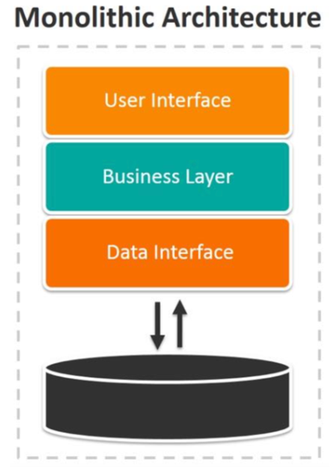
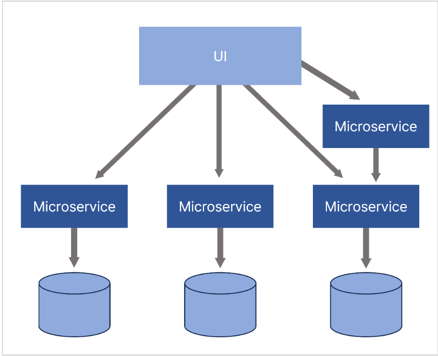
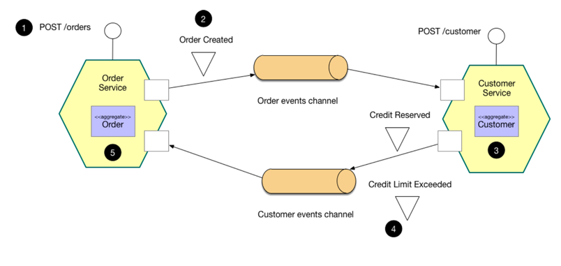
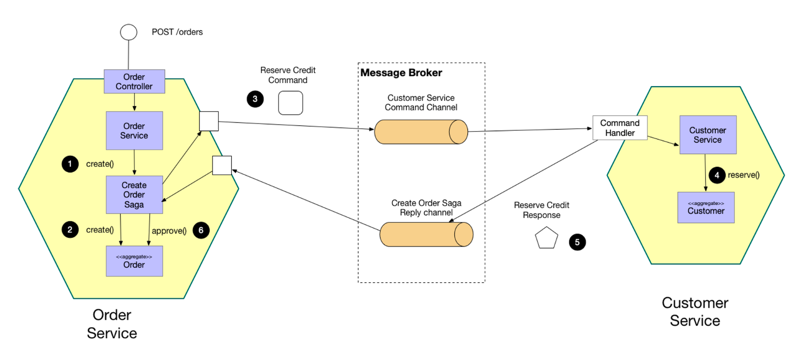
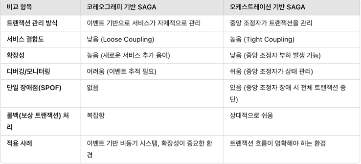

# MSA 전환시 서비스 분리 및 트랜잭션 관리

---

### 개요

현대의 대규모 서비스는 높은 확장성과 유지보수성을 확보하기 위해 모놀리식(Monolithic) 아키텍처에서 마이크로서비스 아키텍처(MSA)로 전환 하기도 한다.
이에 따라 기존 단일 서비스 구조를 분리하는 과정에서 발생할 수 있는 트랜잭션 관리의 어려움을 분석 하고
기존 모놀리식 환경에서는 트랜잭션이 어떻게 처리되었으며 서비스 분리 이후 트랜잭션의 일관성을 유지하기 위한 대표적인 방법인 SAGA 패턴을 비교 분석 해보려 한다.

--- 

### 모놀리식 아키텍처 환경의 트랜잭션 관리와 문제점

먼저 모놀리식 아키텍처는 하나의 어플리케이션에 모든 도메인 서비스의 기능이 통합되어 있는 구조이며,
단일 프로젝트기 때문에 단순한 구조를 띄고 있다.

현재 프로젝트에서 비즈니스 로직들의 트랜잭션 처리를 아래와 같이 진행 하고 있는데 어떤 문제점이 있을까?

- #### 콘서트 좌석 예약 기능 로직

~~~
@Transactional
public void 콘서트_좌석_예약() {
    사용자_조회();
    콘서트_스케쥴_조회();
    콘서트_좌석_조회();
    예약();
    
    try {
        데이터_플랫폼_전송();
    } catch (Exception e) {
        log.error("데이터 플랫폼 전송 실패: {}", e.getMessage());
    }
}
~~~

#### 위 상황에서의 문제점

- 모든 작업이 하나의 트랜잭션 내에서 실행되므로 장애 발생시 모든 작업이 롤백될 수 있다.
    - 특히, 좌석 예약은 실제로 성공했지만 데이터 플랫폼 전송이 실패하게 되면 롤백 됨.
- 데이터 플랫폼 전송이 지연될 경우 사용자 응답 시간이 증가하여 사용자 경험이 저하된다.
- 모든 처리 과정을 하나의 트랜잭션으로 묶다보니 트랜잭션 범위가 넓어져서 DB 커넥션을 오래 점유할 수도 있다.
    - 동시 요청이 많아지게 되면 병목현상을 초래할 수 있다.
- 주요 로직과 보조적인 로직(데이터 플랫폼 전송)이 분리되지 않아 유지보수가 어렵다. (결합도가 높음)

### 개선 방향

- Spring의 Event를 사용하여 데이터 플랫폼 전송을 비동기로 분리 한다.

~~~
public void 콘서트_좌석_예약() {
    사용자_조회();
    콘서트_스케쥴_조회();
    콘서트_좌석_조회();
    예약();
    이벤트_발행(new 콘서트좌석예약됨Event());
}

@Async
@TransactionalEventListener(phase = TransactionPhase.AFTER_COMMIT)
public void 데이터플랫폼전송_이벤트_리스너(예약 Event event) {
    try {
        데이터_플랫폼_전송();
    } catch (Exception e) {
        log.error("데이터 플랫폼 전송 실패: {}", e.getMessage());
    }
}
~~~

- 이벤트 기반 비동기 처리 방식을 적용하면 데이터 플랫폼 전송이 메인 트랜잭션에서 분리되어 비즈니스 로직과의 결합도가 낮아진다.
    - 주요 로직과 부가적인 로직이 분리되어 관심사의 분리(Separation of Concerns)를 달성할 수 있다.
- 메인 트랜잭션에서 비동기 이벤트로 데이터 플랫폼 전송 로직을 분리했기 때문에 응답 속도를 개선할 수 있다.
- 별도의 트랜잭션으로 분리되어 독립적으로 장애에 대응할 수 있다.

---

### MSA 환경에서의 트랜잭션 처리 및 관리

먼저 MSA(Micro Service Architecture)는 서비스가 독립적으로 운영 및 배포될 수 있는 구조로, 서비스별로 독립적인 데이터베이스를 사용한다.(Database Per Service)
서비스가 분리되게 되면 네트워크 통신이 필수적이고 트랜잭션을 직접적으로 관리하기 어렵다는 문제가 발생한다.

#### MSA에서의 트랜잭션 처리 방식

현재의 모놀리식 구조에서 MSA로 전환하게 된다면, 각 서비스는 자체적인 트랜잭션을 관리해야 한다.
예를 들면 기존의 좌석 예약 서비스를 아래와 같이 관리하도록 설계할 수 있다.

~~~
public void 사용자_조회() {
    조회_로직();
}

public void 콘서트_스케쥴_조회() {
    조회_로직();
}

public void 콘서트_좌석_조회() {
    조회_로직();
}

public void 예약() {
    예약_로직();
}
~~~

### MSA(분산 환경) 에서의 트랜잭션 처리의 한계

- 기존의 모놀리식에서의 트랜잭션 ACID(Atomicity, Consistency, Isolation, Durability)를 보장하기 어렵다.
    - 서비스가 각각의 로컬 트랜잭션을 사용하기 때문에 트랜잭션 일관성을 보장하기 어려움.
- 네트워크 장애나 서비스 중단 등으로 인해 어떤 서비스의 로직은 성공했지만 다른 서비스에서는 실패하는 데이터 불일치 문제가 발생할 수 있다.

개별 서비스에서 트랜잭션을 관리하게 되어 각 서비스의 독립성을 보장할 수 있지만 위와 같은 문제로 인해 장애 대응을 강화 해야 하며,
다수의 서비스를 수행하는 트랜잭션의 경우 데이터 일관성 유지를 위해 롤백 및 보상 트랜잭션이 필요할 수 있으며, Saga Pattern을 도입해 볼 수 있다.

--- 

### SAGA 패턴

SAGA 패턴은 분산 시스템에서 긴 트랜잭션(Long-running Transaction)을 관리하는 기법이다.
MSA 환경에서는 여러 서비스가 각자의 데이터베이스를 가지므로, 단일 트랜잭션으로 ACID(원자성, 일관성, 독립성, 지속성)를 보장하기 어렵다.
SAGA는 이러한 한계를 극복하기 위해 각 서비스에서 로컬 트랜잭션을 순차적으로 수행하고, 실패 시 보상 트랜잭션(Compensating Transaction)을 실행하여 데이터 정합성을 유지한다.

---

### SAGA 패턴 방식

**코레오그래피(Choreography) 기반 SAGA**

**동작 방식**

- 각 서비스가 독립적으로 동작하며, 이벤트(Event)를 기반으로 트랜잭션을 이어서 수행한다.
- 하나의 서비스가 트랜잭션을 수행한 후 이벤트를 발행(Publish) 하면, 다음 트랜잭션을 담당하는 서비스가 이를 구독(Subscribe)하여 트랜잭션을 수행하는 방식이다.
- 중앙 조정자가 없이 서비스 간 이벤트 흐름을 통해 트랜잭션이 진행된다.

**콘서트 예약 시스템에서의 결제 프로세스**

1. 예약 서비스(Reservation Service) → 사용자의 좌석 예약 후 "좌석 예약 완료" 이벤트 발행
2. 결제 서비스(Payment Service) → 이벤트를 수신하여 결제 진행 후 "결제 완료" 이벤트 발행
3. 알림 서비스(Notification Service) → 이벤트를 수신하여 사용자에게 결제 완료 메시지 전송

만약 결제가 실패할 경우, 보상 트랜잭션을 수행하여 좌석 예약을 취소하는 이벤트를 발행할 수 있다.

**장점**

- 서비스 간 결합도가 낮다. (Loose Coupling)
    - 각 서비스는 독립적으로 이벤트를 주고받기 때문에, 각 서비스가 다른 서비스의 내부 로직을 몰라도 된다.
    - 새로운 기능 추가 시 기존 코드를 변경할 필요 없이 새로운 이벤트를 추가하면 된다. → 확장성이 뛰어남
- 단일 장애점(Single Point of Failure)이 없다
    - 중앙에서 트랜잭션을 관리하는 조정자가 없기 때문에, 오케스트레이터 장애로 인한 전체 서비스 중단 위험이 낮다.
- 비동기 이벤트 처리로 성능 향상
    - 이벤트 기반 아키텍처이므로 각 서비스가 병렬적으로 실행될 수 있어 처리 속도가 빠르다

**단점**

- 트랜잭션 흐름이 복잡해진다.
    - 이벤트 기반 아키텍처로 인해 서비스 간의 의존성이 증가할 가능성이 있다.
    - 서비스가 많아질수록 트랜잭션의 흐름을 이해하기 어렵다.
- 디버깅 및 모니터링이 어렵다.
    - 트랜잭션이 여러 서비스에 걸쳐 이벤트로 이루어지므로, 어디에서 실패했는지 추적하기 어렵다.
    - 로그를 관리하지 않으면 이벤트가 어디에서 유실되었는지 확인하기 어렵다.
- 보상 트랜잭션(롤백)이 복잡함
    - 이벤트가 비동기로 실행되기 때문에 어떤 서비스에서 장애가 발생했을 경우 이를 감지하고 롤백하는 로직을 따로 구현해야 한다.
    - 이벤트 순서를 보장하는 메커니즘이 필요하다.

--- 
**오케스트레이션(Orchestration) 기반 SAGA**

**동작 방식**

- **중앙 조정자(Orchestrator)**가 전체 트랜잭션을 관리하며, 각 서비스에 명령(Command)을 보내면서 트랜잭션을 진행.
- 중앙 조정자는 서비스의 트랜잭션이 끝날 때까지 상태를 유지하며, 실패 시 보상 트랜잭션을 실행하도록 지시.

**콘서트 예약 시스템에서의 결제 프로세스**

1. 오케스트레이터(Saga Orchestrator) → 사용자에게 좌석 예약 요청
2. 예약 서비스(Reservation Service) → 좌석 예약 후 오케스트레이터에게 성공 응답 반환
3. 오케스트레이터 → 결제 서비스 호출하여 결제 요청
4. 결제 서비스(Payment Service) → 결제 완료 후 오케스트레이터에게 성공 응답 반환
5. 오케스트레이터 → 알림 서비스 호출하여 결제 완료 메시지 전송

만약 결제가 실패하면, 오케스트레이터는 보상 트랜잭션을 호출하여 좌석 예약을 취소.

**장점**

- 트랜잭션 흐름을 명확하게 관리 가능하다.
    - 중앙 조정자가 트랜잭션의 순서와 상태를 관리하므로, 서비스 간 의존성이 낮고 트랜잭션 흐름을 쉽게 추적할 수 있다.
    - 디버깅이 용이하고, 모니터링이 쉽다.
- 보상 트랜잭션 처리 용이하다.
    - 오케스트레이터가 실패를 감지하면 즉시 보상 트랜잭션을 실행할 수 있어 데이터 정합성 유지가 쉽다.
- 비즈니스 로직이 한 곳에서 관리된다.
    - 트랜잭션의 흐름을 하나의 서비스에서 정의하므로, 각 서비스가 독립적으로 이벤트를 관리할 필요 없다.

**단점**

- 중앙 조정자가 단일 장애점(SPOF, Single Point of Failure)이 될 가능성이 있다.
    - 오케스트레이터가 장애가 나면 전체 트랜잭션이 중단될 수 있다
    - 이를 해결하려면 분산 환경에서 오케스트레이터의 장애 대비 전략(예: Failover, Leader Election 등)이 필요하다.
- 확장성이 낮다.
    - 중앙에서 모든 트랜잭션을 관리하기 때문에, 서비스가 많아질수록 오케스트레이터의 부하가 증가 한다.
    - 고성능 시스템에서는 병목(Bottleneck)이 될 가능성이 있다.
- 서비스 간 결합도가 높아질 수 있다.
    - 각 서비스가 오케스트레이터와 직접적으로 연결되어 있어, 오케스트레이터 변경 시 영향을 받을 가능성이 있다.
    - 서비스 변경이 있을 때 오케스트레이터도 함께 수정해야 할 수도 있다.

---

#### 오케스트레이션(Orchestration) vs 코레오그래피(Choreography) 비교

--- 

### 결론

- MSA 전환을 고려할 때, 트랜잭션의 일관성을 보장하는 것은 필수적인 요소이다.
- SAGA는 비동기적으로 트랜잭션을 처리하지만 복잡한 롤백 로직이 필요하다.
- 시스템의 요구사항에 따라 적절한 트랜잭션 처리 방법을 선택해야 하며, 확장성과 유지보수성을 고려한 설계가 중요하다.

---

### 참고 및 출처

- https://microservices.io/patterns/data/saga.html
- https://velog.io/@xlddy02/%EB%AA%A8%EB%86%80%EB%A6%AC%EC%8B%9D-%EC%95%84%ED%82%A4%ED%85%8D%EC%B2%98
- https://metanetglobal.com/bbs/board.php?bo_table=tech&wr_id=38