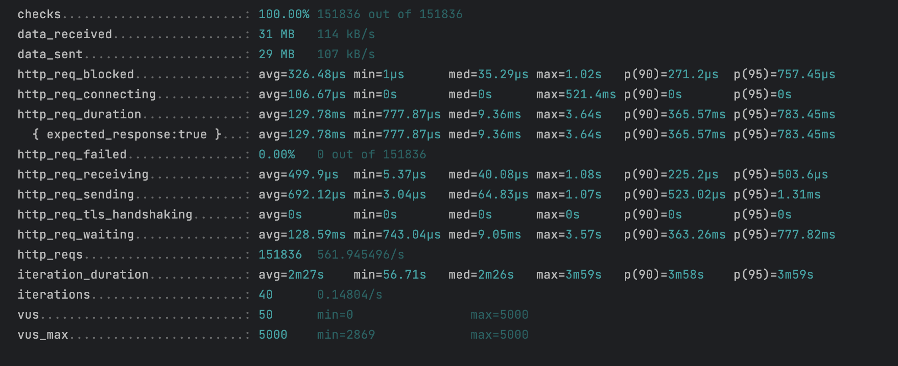
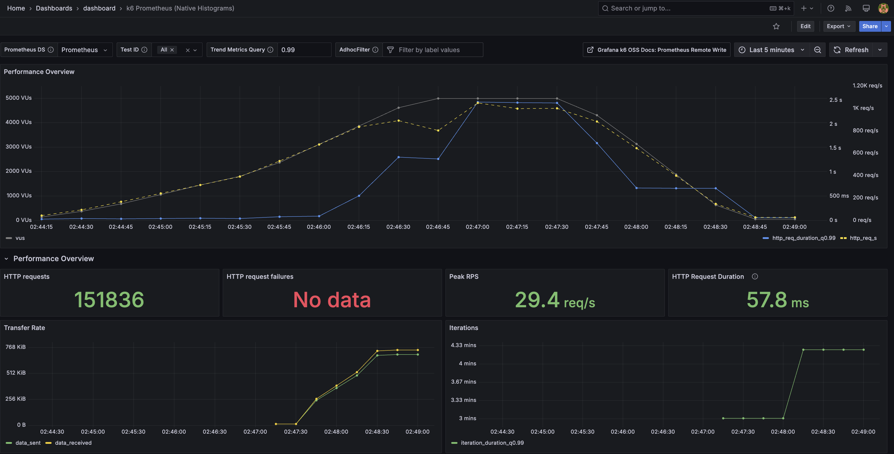
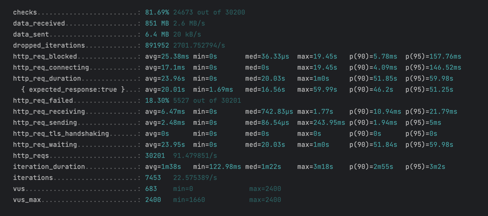
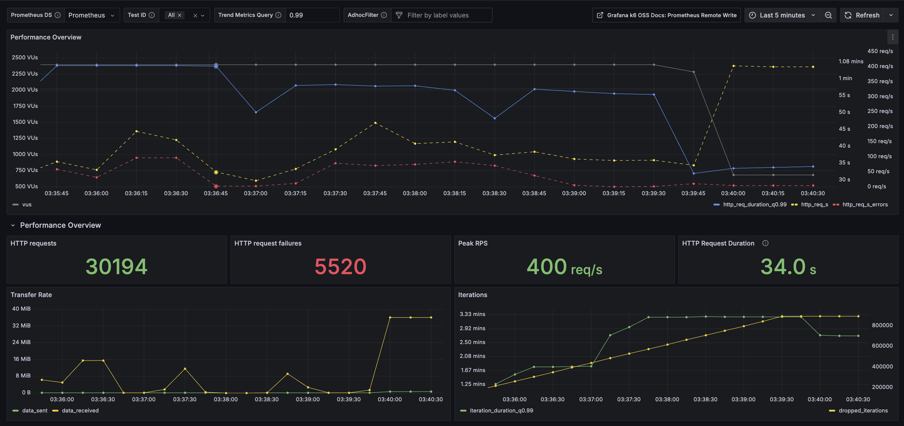
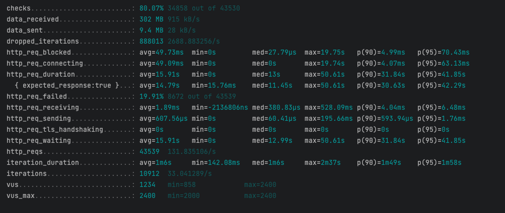
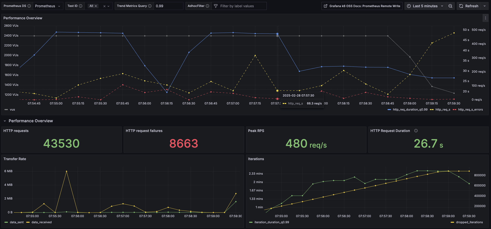

# 부하테스트 대상 선정 및 목적

--- 

## 개요

- 콘서트 예약 서비스의 부하 테스트를 통해 시스템의 성능과 안정성을 검증하고, 병목 구간을 식별하여 개선 방향을 도출한다.
- 콘서트 예약 서비스는 대규모 트래픽이 예상되는 환경에서 동시 접속과 높은 처리량이 중요한 요소다.
  특히 대기열 발급 및 예매 과정에서 성능 저하나 장애가 발생하지 않도록 사전 점검이 필수적이다.
  이런 점검을 통해 사용자 경험을 극대화하고, 서비스의 신뢰성을 높일 수 있다.

---

## 성능 테스트 지표

- 성능 테스트는 시스템의 효율성과 안정성을 평가하기 위해 여러 지표를 사용하는데, 주요 지표는 다음과 같다.

### TPS (Transaction Per Second)

- **정의** : TPS는 시스템이 초당 처리할 수 있는 트랜잭션의 수를 나타내는 지표이다. 시스템의 처리량을 평가하는 데 중요한 역할을 하며, TPS가 높을수록 시스템의 성능이 우수하다고 볼 수 있다.
- **계산식** : TPS = 시스템이 처리한 트랜잭션 수 / 시스템이 처리한 시간
- **예시** : 만약 시스템이 1000개의 트랜잭션을 10초 동안 처리했다면, TPS는 100이 된다.

### Latency (지연 시간)

- **정의** : Latency는 시스템이 요청을 받고 응답을 보내기까지 걸리는 시간을 의미. 시스템의 응답 속도를 나타내며, Latency가 낮을수록 사용자 경험이 향상됨.
- **측정 방법** : 일반적으로 밀리초(ms) 단위로 측정되며, 요청과 응답 간의 시간 차이를 기록한다.

### Error Rate (에러율)

- **정의** : Error Rate는 시스템이 처리한 요청 중 에러가 발생한 비율을 나타낸다. 시스템의 안정성을 평가하는 중요한 지표로, Error Rate가 낮을수록 시스템의 신뢰성이 높다.</br>
- **계산식** : Error Rate = 에러가 발생한 요청 수 / 전체 요청 수
- **예시** : 만약 1000개의 요청 중 10개에서 에러가 발생했다면, Error Rate는 1%.

--- 

## 성능 테스트 종류

성능 테스트는 다양한 방법으로 시스템의 성능을 평가하며, 주요 테스트 종류는 다음과 같다.

### 부하 테스트 (Load Test)

- **목적** : 시스템이 정상적으로 동작하는지 확인하고, 최대 처리량을 평가하기 위한 테스트.
- **방법** : 목표 값을 설정하고, 해당 목표값만큼의 부하를 시스템에 가하여 성능을 측정.

### 스트레스 테스트 (Stress Test)

- **목적** : 시스템이 과부하 상태에서도 정상적으로 동작하는지 확인하기 위한 테스트
- **방법** : 시스템의 최대 처리량을 초과하는 부하를 가하여 성능의 한계를 평가.

### 중단점 테스트 (Breakpoint Test)

- **목적** : 시스템이 어느 정도의 부하까지 견딜 수 있는지를 확인하기 위한 테스트.
- **방법** : 부하를 점진적으로 증가시키며, 시스템이 더 이상 동작하지 않는 지점을 파악.

### 스파이크 테스트 (Spike Test)

- **목적** : 갑작스런 부하가 발생했을 때 시스템이 어떻게 동작하는지 확인하기 위한 테스트.
- **방법** : 이벤트성 부하를 가하여 시스템의 성능을 평가.

---      

## 성능 테스트를 위한 도구 및 환경 설정

### k6

- **정의** : k6는 성능 테스트를 위한 오픈소스 도구로, JavaScript로 테스트 스크립트를 작성하여 성능 테스트를 진행할 수 있다.
- **특징**
    - 다양한 프로토콜(HTTP, Websocket, gRPC)을 지원.
    - CLI(Command Line Interface)를 통해 테스트를 실행할 수 있다.
    - 테스트 결과를 다양한 형태로 출력할 수 있어, 분석 및 보고서 작성에 유용하다.
    - 이와 같은 성능 테스트 지표와 종류를 이해하고 활용하면, 시스템의 성능을 효과적으로 평가하고 개선할 수 있다.

---

## 모니터링 설정

- **k6**: 시나리오 기반 부하 테스트 도구로 다양한 트래픽 상황을 재현.
- **Prometheus**: 메트릭 데이터를 수집하고 저장하는 시스템. Prometheus는 Grafana와의 프로비저닝(Provisioning) 기능을 통해 데이터 소스 및 대시보드를 자동으로 구성할 수 있다는
  장점이 있다.
- **Grafana**: 수집된 데이터를 시각화해 한눈에 확인할 수 있는 대시보드 제공.
- **데이터 소스 등록**: Prometheus를 Grafana 데이터 소스로 등록하고 필요한 대시보드를 코드로 정의.
- **대시보드 구성**: 응답 시간, 요청 처리량, 에러율 등의 주요 메트릭을 중심으로 시각화.

---

## 테스트 시나리오

### 대기열 발급 시나리오

- **목적** : 점진적으로 증가하는 트래픽에 대해 대기열 발급 프로세스의 성능과 안정성을 평가. 최대 부하 상태에서 서버의 응답 속도와 장애 여부를 검증.
- **설정**
    - 가상 사용자 수(VUs):
    - 최대 5000명.
- **부하 증가 및 감소 패턴** : 점진적으로 가상 사용자를 증가시키며 최대 부하를 유지한 후 감소.
- 테스트 시간: 약 5분.

### 대기열 발급 k6 테스트 script

~~~
import http from 'k6/http';
import {check, sleep} from 'k6';

export const options = {
    scenarios: {
        waiting_queue_test: {
            executor: 'ramping-vus', // 가상유저 점진적 증가
            startVUs: 0, // 초기 사용자 0명
            stages: [
                {duration: '30s', target: 500},  // 30초 동안 500명까지 증가
                {duration: '1m', target: 2000},  // 1분 동안 2000명까지 증가
                {duration: '1m', target: 5000},  // 1분 동안 5000명까지 증가
                {duration: '30s', target: 5000}, // 30초 동안 5000명 유지
                {duration: '1m', target: 0},     // 1분 동안 0명으로 감소
            ],
        },
    },
};

const API_BASE_URL = 'http://host.docker.internal:8080/api/v1/token';

export default function () {
    // 대기열 토큰 발급
    const createResponse = http.post(`${API_BASE_URL}/create`, {}, {
        headers: {'Content-Type': 'application/json'},
    });

    check(createResponse, {
        'Token creation status is 201': (r) => r.status === 201,
    });
    let token = createResponse.json()?.uuid;


    // 5초 간격 대기열 조회
    let waitingQueue = null;

    while (true) {
        const queryResponse = http.get(`${API_BASE_URL}`, {
            headers: {
                'Content-Type': 'application/json',
                'X-Waiting-Token': token,
            },
        });

        check(queryResponse, {
            'Query status is 200': (r) => r.status === 200,
        });

        waitingQueue = queryResponse.json().waitingQueueWithPositionResult;
        if (waitingQueue?.position === 0) {
            break;
        }

        sleep(5);
    }
}
~~~




### 주요 지표

- 서버 연결 시간 (http_req_connecting)
    - 서버에 연결하는 데 걸린 평균 시간은 106.67µs 이고, 이정도면 바로 연결된 수준이다.
- HTTP 요청 응답 시간 (http_req_duration)
    - HTTP 요청을 보내고 응답을 받는 데 걸린 평균 시간은 129.78ms 였다. 대기열이 활성화 될 때까지 조회하기 떄문에 시간이 많이 소요되기도 한다.
    - P90이 365.57ms, P95은 783.45ms 이며 최대 응답 시간은 3.64s 이다.
- 서버 응답 대기 시간 (http_req_waiting)
    - 서버에서 응답을 기다리는 데 걸린 평균 시간은 128.59ms 이다.

대기열 관련 기능은 에러율도 0이고 안정적인 상태로 판단되며, 트래픽 처리 관련 성능이 어느정도 확보된 것으로 파악된다.

### 콘서트 예약 시나리오

- **목적** :예약 프로세스의 여러 단계가 병목 없이 처리되는지 확인. 초당 요청 속도를 일정하게 유지하며 서버의 처리 용량과 안정성을 평가.
- **설정**
    - 초당 요청 속도(TPS): 3000
    - 최대 가상 사용자 수(VUs): 2000명.
- **maxVUs**: 2400명 (20% 여유).
- **단계별 대기 시간**: 사용자 행동을 반영하여 각 단계에 0.5~3초의 대기 시간 추가.
- **테스트 지속 시간**: 5분.

### 콘서트 예약 k6 테스트 script

```
import http from 'k6/http';
import {check, fail, sleep} from 'k6';

export const options = {
    scenarios: {
        booking_scenario: {
            executor: 'constant-arrival-rate',
            rate: 3000, // 초당 요청 속도 (TPS)
            timeUnit: '1s',
            duration: '5m', // 테스트 지속 시간: 5분
            preAllocatedVUs: 2000, // 최대 가상 사용자 수
            maxVUs: 2400, // 최대 VUs (20% 여유)
        },
    },
};


// 0.5초 ~ 3초 사이의 값을 반환
function getRandomWaitTime(min = 0.5, max = 3) {
    return Math.random() * (max - min) + min;
}

export default function () {
    const concertId = 1;
    const token = 'test-token';
    const userId = Math.floor(Math.random() * 1000) + 1;

    // Step 1: 예약 가능 콘서트 스케쥴 조회
    const scheduleResponse = http.get(
        `http://host.docker.internal:8080/api/v1/concert/${concertId}/available-schedules`,
        {
            headers: {
                'Content-Type': 'application/json',
                'X-Waiting-Token': token
            },
        }
    );

    if (!check(scheduleResponse, {'Schedule list status is 200': (r) => r.status === 200})) {
        fail(`Schedule list request failed with status: ${scheduleResponse.status}`);
        return;
    }

    sleep(getRandomWaitTime());

    const schedules = scheduleResponse.json().concertSchedules;
    if (!schedules || schedules.length === 0) {
        fail('No schedules available for booking.');
        return;
    }

    let randomIndex = Math.floor(Math.random() * schedules.length);
    const concertScheduleId = schedules[randomIndex].id;

    // Step 2: 예약 가능한 좌석 조회
    const seatResponse = http.get(
        `http://host.docker.internal:8080/api/v1/concert/${concertScheduleId}/available-seats`,
        {
            headers: {
                'Content-Type': 'application/json',
                'X-Waiting-Token': token
            },
        }
    );

    if (!check(seatResponse, {'Seat list status is 200': (r) => r.status === 200})) {
        fail(`Seat list request failed with status: ${seatResponse.status}`);
    }
    sleep(getRandomWaitTime()); // 랜덤 대기

    const seats = seatResponse.json().concertSeatInfo;
    if (!seats) {
        fail('No seats available for booking.');
        return;
    }

    if (seats.length === 0) {
        return; // 예약 가능한 좌석이 없으면 종료
    }


    const randomCount = Math.floor(Math.random() * 2) + 1;
    const shuffledSeats = seats.concertSeat.sort(() => 0.5 - Math.random());
    const selectedSeats = shuffledSeats.slice(0, Math.min(randomCount, shuffledSeats.length));
    const seatIds = selectedSeats.map(seat => seat.id);

    // Step 3: 좌석 선택 및 예약 요청
    const reserveResponse = http.post(
        `http://host.docker.internal:8080/api/v1/concert/reservation`,
        JSON.stringify({
            userId: userId,
            concertScheduleId: concertScheduleId,
            seatIds: seatIds,
            dateTime: new Date()
        }),
        {
            headers: {
                'Content-Type': 'application/json',
                'X-Waiting-Token': token
            },
        }
    );

    if (!check(reserveResponse, {'Reservation status is 201': (r) => r.status === 201})) {
        fail(`Reservation request failed with status: ${reserveResponse.status}`);
        return;
    }
    sleep(getRandomWaitTime());

    const reservation = reserveResponse.json();
    if (!reservation) {
        fail('Reservation response does not contain reservation details.');
        return;
    }

    const reservationId = reservation.id;

    // Step 4: 사용자 잔액 조회 및 충전 요청
    const UserWalletResponse = http.get(
        `http://host.docker.internal:8080/api/v1/users/${userId}/wallet`,
        {
            headers: {
                'Content-Type': 'application/json',
            },
        }
    );

    if (!check(UserWalletResponse, {'Wallet status is 200': (r) => r.status === 200})) {
        fail(`Wallet request failed with status: ${UserWalletResponse.status}`);
        return;
    }


    sleep(getRandomWaitTime());

    const chargeResponse = http.patch(
        `http://host.docker.internal:8080/api/v1/users/charge/point`,
        JSON.stringify({userId: userId, point: 100}),
        {
            headers: {
                'Content-Type': 'application/json',
                'X-Waiting-Token': token
            },
        }
    );

    if (!check(chargeResponse, {'Charge status is 200': (r) => r.status === 200})) {
        fail(`Charge request failed with status: ${chargeResponse.status}`);
        return;
    }
    sleep(getRandomWaitTime());

    // Step 5: 결제 완료 요청
    const paymentResponse = http.post(
        `http://host.docker.internal:8080/api/v1/payment`,
        JSON.stringify({userId: userId, reservationId: reservationId, token: token}),
        {
            headers: {
                'Content-Type': 'application/json',
                'X-Waiting-Token': token
            },
        }
    );

    if (!check(paymentResponse, {'Payment status is 200': (r) => r.status === 200})) {
        fail(`Payment request failed with status: ${paymentResponse.status}`);
        return;
    }
    sleep(getRandomWaitTime());
}
```




### 주요 지표

- 서버 연결 시간 (http_req_connecting)
    - 서버에 연결하는 데 걸린 평균 시간은 17.1ms 이다.
- HTTP 요청 응답 시간 (http_req_duration)
    - HTTP 요청을 보내고 응답을 받는 데 걸린 평균 시간은 23.96s 였다.
    - P90이 51.85s, P95은 59.98s 이며 최대 응답 시간은 1m 이다.
- 서버 응답 대기 시간 (http_req_waiting)
    - 서버에서 응답을 기다리는 데 걸린 평균 시간은 23.95s 이다.

콘서트 예약의 경우 에러가 총 5520건 실패했는데, 주요 에러로는 이미 예약된 좌석에 대한 오류로 파악된다.
또한 트래픽 부하 및 좌석 충돌로 인해 응답시간이 높아지는 현상이 관찰되었다.

--- 

## 가상 장애 보고서

### 장애 개요

- **발생 시점**: 부하 테스트 중
- **발생 서비스**: 콘서트 예약 시스템
- **장애 유형**: 응답 시간 지연
- **주요 증상**: 정상적인 대기열 시나리오와 비교했을 때 과도한 응답 시간 증가가 발생했다.

### 장애 원인 분석

주요 원인은 캐시 스탬피드(Cache Stampede) 발생이며 Redis 캐시 만료로 인해 다수의 요청이 동시에 데이터베이스를 참조하면서 과부하가 발생했다.
캐시 미스(Cache Miss)가 빈번해지면서 데이터베이스 트래픽이 급격히 증가하였고, 이는 응답 시간 지연으로 이어졌다.

### 조치 사항 및 결과

조치 사항으로는 캐시 워밍(Cache Warming) 도입 하여 예약 시작 전에 콘서트 정보와 스케줄 데이터를 미리 캐싱하여 초기 부하를 완화했다.
캐시 만료 정책 변경 또한 콘서트 및 스케줄 정보 캐시 만료 시간을 연장해 캐시 갱신 빈도를 줄였다.

조치 결과




### 주요 지표

- HTTP 요청 응답 시간 (http_req_duration)
    - HTTP 요청을 보내고 응답을 받는 데 걸린 평균 시간은 기존 23.96s -> 15.91s 였다.
    - P90이 기존 51.85s -> 31.84s, P95은 기존 59.98s -> 41.85s 이며 최대 응답 시간은 1m 이내이다.
- 서버 응답 대기 시간 (http_req_waiting)
    - 서버에서 응답을 기다리는 데 걸린 평균 시간은 15.91s 이다.

기존의 시나리오에서 현재 캐시 히트율(Cache Hit Rate)이 증가하면서 데이터베이스 호출 빈도가 줄어 어느정도 성능 개선이 되긴 했지만
아직 좀 더 최적화 해야할 것으로 판단됨. 배포되어 있는 docker 서비스 cpu와 memory의 영향도 있겠지만 최대한 로직에서 성능개선이
되어야 할 부분이 있는지 면밀히 검토해보고 지속적으로 모니터링 해봐야 할 것 같다.

### 향후 개선 방안

- 캐시 미스율(Cache Miss Rate)과 데이터베이스 부하를 실시간으로 모니터링할 수 있는 시스템을 구축.
- Redis 캐시 만료가 임박하거나 캐시 미스율이 급증할 경우, 알림을 통해 빠르게 대응할 수 있는 체계를 마련.
- 대기열 트래픽 분산 활성 대기열의 요청 수를 줄이고 트래픽을 효과적으로 분산하여 서버 부하를 완화합니다.

### 결론

이번 장애는 Redis 캐시 만료로 인한 캐시 스탬피드 현상으로 데이터베이스 부하가 급격히 증가하면서 발생한 응답 시간 지연이 주요 원인이었다.
캐시 워밍 도입과 캐시 만료 정책 변경을 통해 어느정도 문제를 해결했으며, 향후 모니터링 시스템과 대기열 트래픽 분산을 통해 보다 안정적인 서비스 운영을 목표로 할 계획이다.