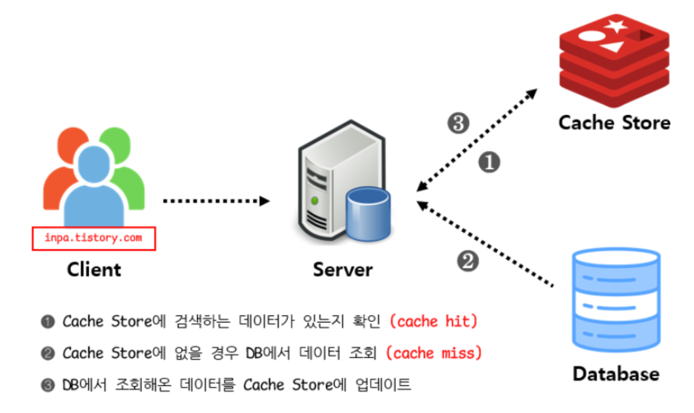
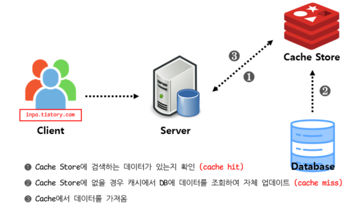
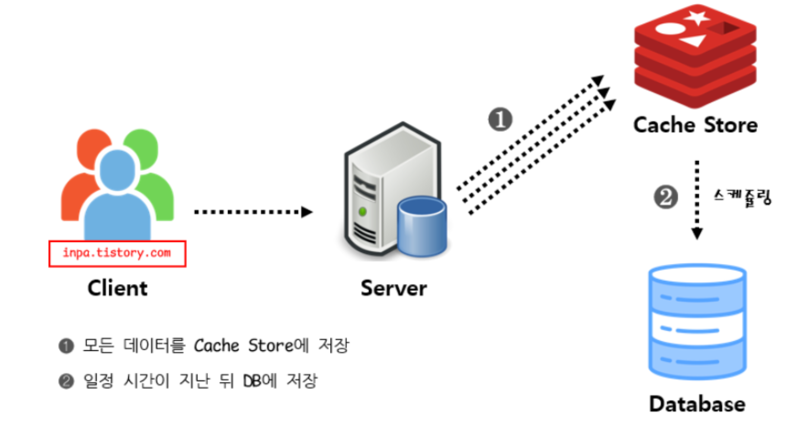
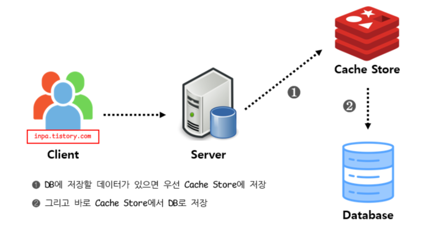
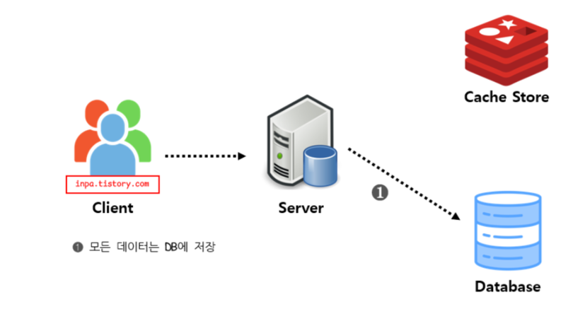
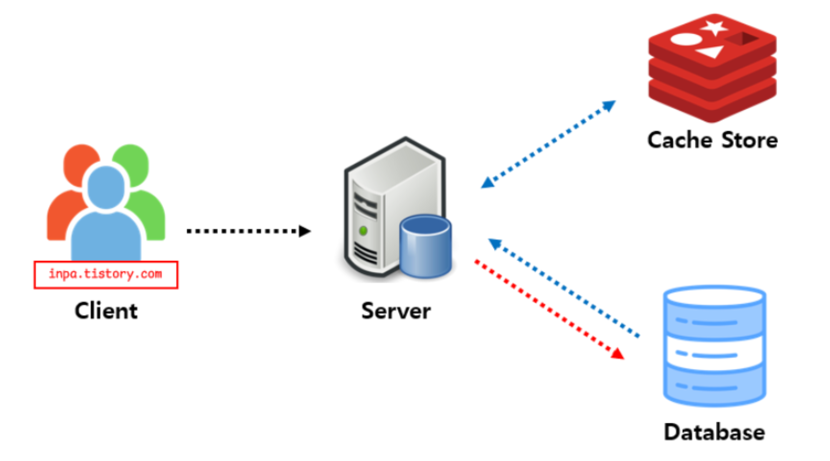
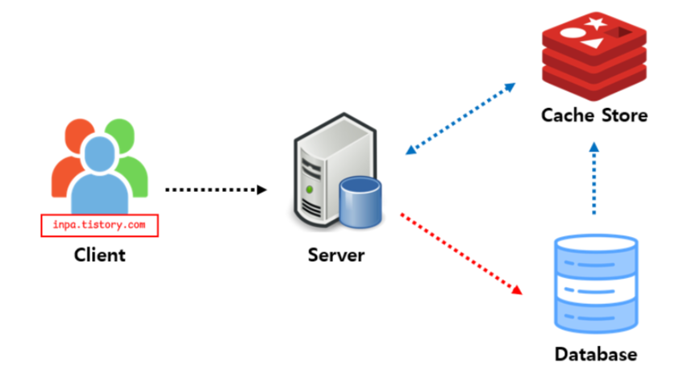
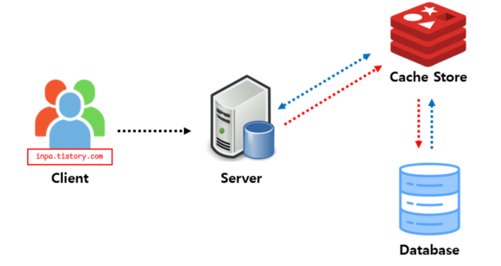

# 캐싱을 통한 성능 개선 전략

--- 

## 1. 캐시의 개념과 장점

### 1.1 캐시란?

- 캐시(Cache)는 데이터를 임시 저장소(RAM 등)에 저장하여 동일한 요청에 대해 더 빠르게 응답하는 기술이다.
  주로 자주 조회되거나 계산 비용이 높은 데이터를 저장하여 성능을 최적화하는 데 사용된다.
  캐시는 CPU, 웹 서버, 데이터베이스 등 다양한 시스템에서 활용된다.

### 캐시 사용이 적합한 데이터 유형:

- 자주 조회되는 데이터
    - 인기 있는 상품의 정보나 사용자 프로필 데이터는 자주 조회되므로 캐시에 저장하면 성능을 향상시킬 수 있다.
- 데이터 변경 주기가 긴 데이터
    - 주식 시장의 과거 데이터나 뉴스 기사와 같이 자주 변경되지 않는 데이터는 캐시에 저장하여 조회 성능을 높일 수 있다.
- 데이터의 실시간 최신화가 이뤄지지 않아도 서비스 품질에 영향이 거의 없는 데이터
    - 날씨 정보와 같은 데이터는 실시간으로 업데이트되지 않아도 사용자가 큰 불편을 느끼지 않으므로 캐시를 통해 빠르게 제공할 수 있다.

### 1.2 캐시의 장점

- 응답 속도 개선: 캐시에 저장된 데이터를 활용하여 빠른 응답을 제공함으로써 고객의 UX를 향상시킨다.
    - 웹사이트에서 사용자가 자주 조회하는 페이지를 캐시에 저장하면 페이지 로딩 속도가 빨라져 사용자 만족도가 높아질 수 있음.
- 부하 감소: 캐시 히트(Cache Hit)를 통해 데이터베이스 접근 횟수를 줄여 부하를 감소.
    - 대규모 온라인 쇼핑몰에서 인기 상품의 정보를 캐시에 저장하면, 수천 명의 사용자가 동시에 해당 정보를 요청하더라도 데이터베이스에 대한 부하를 줄일 수 있다.
- 비용 절감: 네트워크 및 I/O 연산 비용을 절감.
    - 클라우드 기반 서비스에서 데이터베이스에 대한 요청이 줄어들면, 데이터 전송 비용과 데이터베이스 사용 비용이 감소하여 운영 비용을 절감할 수 있다.
- 확장성 향상: 트래픽이 증가해도 데이터베이스 부하를 줄여 원활한 서비스 제공이 가능.
    - 특정 이벤트나 세일 기간 동안 사용자 트래픽이 급증할 때, 캐시를 활용하면 데이터베이스에 대한 요청을 최소화하여 시스템이 안정적으로 운영될 수 있다.

--- 

## 2. 로컬 캐시와 글로벌 캐시

### 2.1 로컬 캐시 (In-Memory Cache)

- 로컬 캐시는 서버 내부에서 메모리를 활용하여 캐시를 저장하는 방식이다.
  대표적인 예로는 Ehcache, Caffeine, Guava 등이 있다.
  이 캐시는 특정 서버의 메모리에만 저장되기 때문에, 해당 서버에서만 접근할 수 있다.

### 장점

- 메모리에서 직접 데이터를 읽어오기 때문에 응답 속도가 매우 빠르다.
  예를 들어, 웹 애플리케이션에서 사용자 세션 정보를 로컬 캐시에 저장하면, 사용자가 페이지를 전환할 때마다 빠르게 세션 정보를 조회할 수 있다.
- 데이터가 서버 내부에 저장되므로 네트워크를 통한 데이터 전송이 필요 없어 비용이 절감된다.

### 단점

- 여러 서버가 있을 경우, 각 서버의 로컬 캐시가 서로 다를 수 있어 데이터 일관성을 유지하기 어렵다.
  예를 들어, A 서버에서 캐시된 데이터가 B 서버에서는 업데이트되지 않으면, 사용자에게 잘못된 정보를 제공할 수 있다.
- 서버의 메모리 용량이 한정적이기 때문에, 캐시할 데이터가 많아지면 메모리가 부족해질 수 있다. 이 경우, 오래된 데이터가 삭제되거나 캐시가 비워질 수 있다.

### 2.2 글로벌 캐시 (Distributed Cache)

- 글로벌 캐시는 여러 서버가 하나의 캐시 서버를 공유하는 방식이다.
  Redis, Memcached와 같은 시스템이 대표적이다.
  이 방식은 여러 서버에서 동일한 캐시 데이터를 사용할 수 있도록 해준다.

### 장점

- 모든 서버가 동일한 캐시 서버를 사용하므로 데이터 일관성을 쉽게 유지할 수 있다.
  예를 들어, 사용자가 A 서버에서 데이터를 업데이트하면, B 서버에서도 즉시 업데이트된 데이터를 조회할 수 있다.
- 서버를 추가하더라도 캐시 서버를 공유하므로 시스템의 확장성이 뛰어나다.
  대규모 트래픽을 처리해야 하는 서비스에서 유리하다.

### 단점

- 캐시 서버와의 통신이 필요하므로 네트워크 비용이 발생한다.
  예를 들어, 데이터베이스와의 통신이 많아지면 네트워크 대역폭이 소모될 수 있다.
- 네트워크를 통해 데이터를 가져와야 하므로 로컬 캐시보다 응답 속도가 느릴 수 있다.
  예를 들어, 사용자가 웹 페이지를 요청할 때, 글로벌 캐시에서 데이터를 가져오는 과정이 추가되면 로딩 시간이 늘어날 수 있다.

--- 

## 3. 캐시의 전략과 패턴

### 3.1 캐시 읽기 전략 (Read Strategy)

### Look Aside (Cache Aside) 패턴

- 동작 방식
    - 애플리케이션이 먼저 캐시에서 데이터를 조회한다.
    - 만약 캐시에 데이터가 없다면, 데이터베이스(DB)에서 데이터를 조회하고, 그 데이터를 캐시에 저장한 후 응답을 반환한다.
      
- 장점
    - 캐시가 장애가 발생하더라도 데이터베이스에서 직접 데이터를 조회할 수 있어 시스템의 가용성이 높아진다.
- 단점
    - 캐시 미스가 발생할 경우, 데이터베이스에 대한 부하가 증가해서 성능 저하가 발생할 수 있다.
- 주의
    - 캐시가 만료되면 여러 요청이 동시에 DB에 접근하게 되어 Cache Stampede 현상이 발생할 수 있다. 이를 방지하기 위해 요청을 조율하거나, 캐시를 미리 갱신하는 전략이 필요하다.
- 예시
    - 전자상거래 웹사이트에서 상품 정보를 조회할 때, 사용자가 상품 정보를 요청하면 먼저 캐시에서 확인하고, 없을 경우 DB에서 조회하여 캐시에 저장하는 방식이다.

### Read Through 패턴

- 동작 방식
    - 캐시가 직접 데이터베이스에서 데이터를 조회하여 갱신한다.
    - 애플리케이션은 캐시를 통해 데이터를 요청하며, 캐시가 데이터가 없을 경우 DB에서 자동으로 데이터를 가져와 갱신한다.
      
- 장점
    - 데이터 정합성이 유지되며, 애플리케이션은 캐시만을 통해 데이터에 접근할 수 있다.
- 단점
    - 캐시가 장애가 발생하면 서비스 이용이 불가능해질 수 있다.
- 해결
    - 캐시 복제(Replication) 및 클러스터링을 통해 장애를 극복할 수 있다.
- 예시
    - 소셜 미디어 플랫폼에서 사용자 프로필 정보를 요청할 때, 캐시가 자동으로 DB에서 최신 정보를 가져와 갱신하는 방식이다.

### 3.2 캐시 쓰기 전략 (Write Strategy)

### Write Back (Write Behind) 패턴

- 동작 방식
    - 데이터를 먼저 캐시에 저장한 후, 일정 주기로 데이터베이스에 반영한다.
    - 이 과정에서 캐시가 DB의 역할을 대신한다.
      
- 장점
    - 데이터베이스에 대한 부하가 감소하고, 쓰기 성능이 최적화된다.
- 단점
    - 캐시 장애가 발생할 경우, 데이터 유실의 위험이 있다.
- 예시
    - 로그 데이터를 수집하는 시스템에서, 로그를 캐시에 저장한 후 주기적으로 데이터베이스에 반영하는 방식이다.

### Write Through 패턴

- 동작 방식
    - 데이터를 캐시에 먼저 저장한 후, 즉시 데이터베이스에 반영한다.
    - 이 방식은 데이터의 일관성을 보장한다.
      
- 장점
    - 데이터 정합성이 유지되며, 데이터베이스와 캐시 간의 동기화가 이루어진다.
- 단점
    - 데이터베이스에 대한 쓰기 부하가 증가할 수 있다.
- 예시
    - 사용자 설정을 저장하는 애플리케이션에서, 사용자가 설정을 변경할 때마다 캐시와 DB에 동시에 반영하는 방식이다.

### Write Around 패턴

- 동작 방식
    - 데이터를 데이터베이스에만 저장하고, 캐시는 따로 갱신하지 않는다.
    - 캐시는 다음 읽기 요청 시에만 갱신된다.
      
- 장점
    - 쓰기 성능이 최적화되며, 불필요한 캐시 갱신을 피할 수 있다.
- 단점
    - 캐시 미스가 증가할 가능성이 있으며, 이로 인해 DB에 대한 부하가 증가할 수 있다.
- 예시
    - 뉴스 웹사이트에서 기사를 작성할 때, 작성된 기사를 DB에만 저장하고, 사용자가 기사를 요청할 때 캐시를 갱신하는 방식이다.

## 캐시 읽기 + 쓰기 전략 조합

### Look Aside + Write Around 조합

- 가장 일반적인 조합
  

### Read Through + Write Around 조합

- 데이터 정합성 이슈에 대한 안전장치를 구성할 수 있음
  

### Read Through + Write Through 조합

- 항상 최신 캐시 데이터 보장
- 데이터 정합성 보장
  

--- 

## 4. 캐시 사용시 문제 및 해결 방안

### 4.1 캐시 쇄도 (Cache Stampede)

- 문제
    - 캐시 만료 후 다수의 요청이 데이터베이스(DB)에 몰려 부하가 발생하는 현상이다.
      이로 인해 DB의 성능이 저하되고, 서비스의 응답 속도가 느려질 수 있다.

- 해결 방안
    - Cache Warming: 캐시를 미리 생성하여 사용자가 요청하기 전에 필요한 데이터를 미리 로드하는 방법이다. 이를 통해 캐시 미스를 줄이고, DB에 대한 부하를 감소시킬 수 있다.
    - TTL 분산: 캐시의 만료 시간을 무작위화하여 여러 요청이 동시에 DB에 접근하는 것을 방지하는 방법이다. 이를 통해 캐시 만료로 인한 부하를 분산시킬 수 있다.
    - PER 알고리즘: 확률적 조기 재계산(Probabilistic Early Recalculation) 기법을 적용하여, 캐시가 만료되기 전에 미리 데이터를 갱신하는 방법이다. 이를 통해 캐시 미스를 줄이고,
      DB에 대한 부하를 감소시킬 수 있다.

### 4.2 캐시 관통 (Cache Penetration)

- 문제
    - 존재하지 않는 데이터에 대한 요청이 들어올 경우, 캐시에 저장하지 않고 데이터베이스(DB)를 반복적으로 조회하는 현상이다.
      이로 인해 불필요한 DB 조회가 발생하고, 성능 저하가 일어날 수 있다.

- 해결 방안
    - Null Object Pattern: '데이터 없음' 상태를 캐시에 저장하여, 이후 동일한 요청이 들어올 경우 캐시에서 바로 응답하도록 하는 방법이다.
      이를 통해 불필요한 DB 조회를 방지할 수 있다.
    - 블룸 필터(Bloom Filter): 데이터의 존재 여부를 미리 판단하여, 요청이 들어올 때 캐시에서 확인하고, 존재하지 않을 경우에만 DB를 조회하는 방법이다.
      이를 통해 불필요한 DB 조회를 줄이고, 성능을 향상시킬 수 있다.

## 5. 현 프로젝트 비즈니스 로직 캐시 적용 사례

- 콘서트 티케팅의 경우 앞서 대기열 존재하기 때문에
  어느정도 부하가 분산된다고 생각해서 캐싱을 적용할 만한 사례가 있을까? 고민 했지만
  대기열을 통과한 다수의 사용자가 같은 콘서트의 스케쥴이나 좌석을 조회하게 되는 상황도
  있을 수 있기 때문에 예약 가능한 콘서트 스케쥴 조회와, 좌석에 대하여 캐싱을 적용해 보았다.

### 5.1 콘서트 스케줄 조회 캐싱 적용

#### 선정 이유

- 예약 가능 콘서트 스케쥴 조회의 경우 자주 변하지 않는 데이터이면서 조회도 빈번하게 일어날 것으로 판단해서
  캐시 사용이 적당하다고 생각. 해당 목록을 캐시에 저장해두면 매번 DB에 접근할 필요 없기 때문에 조회 속도가 향상.

#### 구현 방법

- 잦은 조회와 Redis의 장애가 발생해도 서비스가 중단되지 않아야 하므로 Look Aside 패턴을 사용.
- 캐시에 데이터가 없을 때 DB 먼저 조회 후 캐시에 저장하고, 캐시 만료 시간(TTL)을 설정해 일정 시간이 지나면 캐시를 삭제하도록 구현.
- Redis를 사용하여 여러 서버에서 공유할 수 있도록 구성(다중 인스턴스인 경우 로컬 캐시를 사용하는 것보다는 일관성있는 데이터를 제공할 수 있다.)

### 5.2 콘서트 좌석 조회 캐싱 적용

#### 선정 이유

- 예약 가능 좌석 조회의 경우는 스케쥴 조회에 비해 변경이 잦지만 조회도 많기 때문에 적절한 캐시 무효화 전략과
  함께 사용하면 어느정도 이점이 있다고 판단하여 적용.

#### 구현 방법

- 스케쥴 조회와 마찬가지로 Look Aside 패턴을 사용.
- 하지만 좌석 조회의 경우 좌석 예약과 같은 상태 변화가 생겼을 때 캐시에 저장되어 있는 데이터도 수정해 줘야 하기 때문에
  TTL을 짧게 부여하고 @CachePut을 통해 캐시가 갱신되도록 구현.
- 추후에 상태 변화가 너무 잦게 되외 개선을 한다고 하면 @CacheEvict와 스케쥴러를 통해 개선해 볼 수 있다고 생각.

--- 

## 대기열 성능 개선

- 기존 콘서트 예약 프로젝트에서 대기열을 RDBMS로 관리하던 방식을 개선하기 위해 Redis의 ZSet을 활용했다.
  이를 통해 대기열 처리 성능을 높이고 시스템의 부하를 줄이는 것이 목표이다.

### RDBMS 기반 대기열 방식의 단점

- 영속성 불필요: 대기열 데이터는 일시적인 정보이기 때문에 영속성이 필요하지 않다.
  하지만 RDBMS로 관리할 경우 불필요한 데이터 저장이 발생하며, 삭제에도 비용이 소요됨.
- Disk I/O 부하: 대기열에는 다수의 요청이 동시에 발생할 수 있는데,
  RDBMS 기반의 Disk I/O 사용은 이러한 요청을 처리하면서 시스템 부하를 증가시킬 수 있다.
- 조회 성능 저하: 콘서트별로 대기열을 관리하기 때문에 단순 Id 조회가 아닌 Count 집계 함수를 사용해야 하며,
  이는 데이터베이스에 부하를 더할 수 있다.

### Redis 기반 대기열 방식의 장점

- 고속 I/O 처리: Redis는 In-memory DB로 Disk보다 빠른 I/O 처리가 가능하여 대기열 요청을 효율적으로 처리할 수 있다.
- 책임 분산 및 확장성: 대기열 데이터를 Redis로 분산해 관리하면 시스템 부담을 줄일 수 있으며, Redis 클러스터링을 통해 높은 확장성을 확보할 수 있다.
- 효율적인 조회: Redis의 ZSet(Sorted Set)은 정렬된 구조를 제공하여 대기열 순번 조회를 더 빠르고 간편하게 수행할 수 있다.

### ZSet이란?

- ZSet은 Sorted Set의 약자로, 정렬된 순서를 가진 Set을 의미.
- Set은 중복을 허용하지 않는 데이터 구조로, ZSet은 이러한 Set에 정렬 순서를 추가한 형태.
- Redis의 ZSet은 각 요소에 Score(점수)를 부여해 정렬된 순서를 유지하며, Key-Value 형태로 저장.
  여기서 Key는 Set의 이름, Value는 Member(요소)와 Score로 구성.

### ZSet의 주요 명령어

- ZADD key score member: ZSet에 Member를 추가하고, Score를 부여.
- ZSCORE key member: ZSet에서 Member의 Score를 조회.
- ZREM key member: ZSet에서 Member를 삭제.
- ZCARD key: ZSet의 요소 개수를 조회.
- ZCOUNT key min max: ZSet에서 Score가 min과 max 사이인 요소의 개수를 조회.
- ZINCRBY key increment member: ZSet의 Member의 Score를 증가.
- ZRANK key member: ZSet에서 Member의 순위를 조회.
- ZREVRANK key member: ZSet에서 Member의 역순위를 조회.

### 대기열 방식 변경

- 기존에는 은행창구 방식, 즉 줄을 세우는 방식을 사용.
  이 방식은 활성화될 수 있는 토큰의 개수를 정하고 자리가 남으면 대기 순서대로 활성화시키는 방식.
  그러나 이 방식은 활성화된 토큰이 만료되는 시간을 정확히 알기 어렵다.
  만료 시간이 되거나 좌석 결제를 완료하면 만료되는 경우가 있기 때문이다.
  이러한 방식은 대기하는 토큰에게 정확한 대기 시간을 알려주지 못한다.
  이와 같은 이유로 놀이공원 방식으로 변경.
  이 방식은 특정 T 시간마다 대기 중인 토큰 N개를 활성화시키는 방식이다.
  이 방식에서는 N개의 크기에 따라 먼저 대기한 사람과 나중에 대기한 사람이 같은 대기 시간을 가지게 된다.
  대기열을 구축하는 이유가 순서가 중요하다면 이전 방식을 활용해야 하지만, 콘서트 예약 시스템에서는 동시 접속자에 의한 시스템 부하를 줄이는 것이 목적이기 때문에 놀이공원 방식을 활용.

--- 

### 참고 사례 및 출처

- https://brightstarit.tistory.com/57