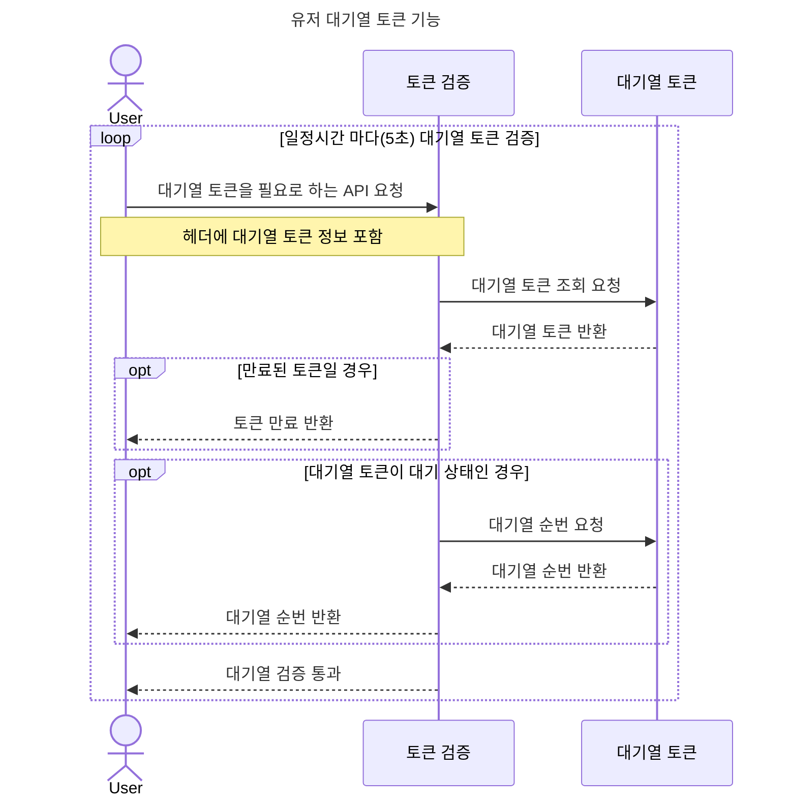
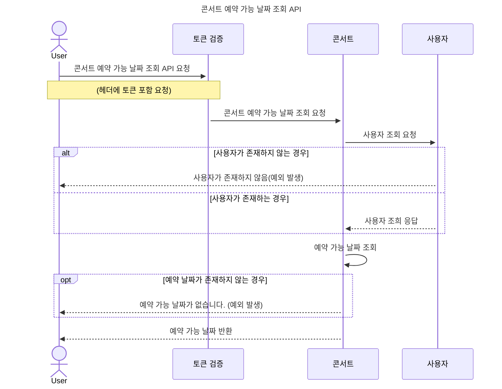
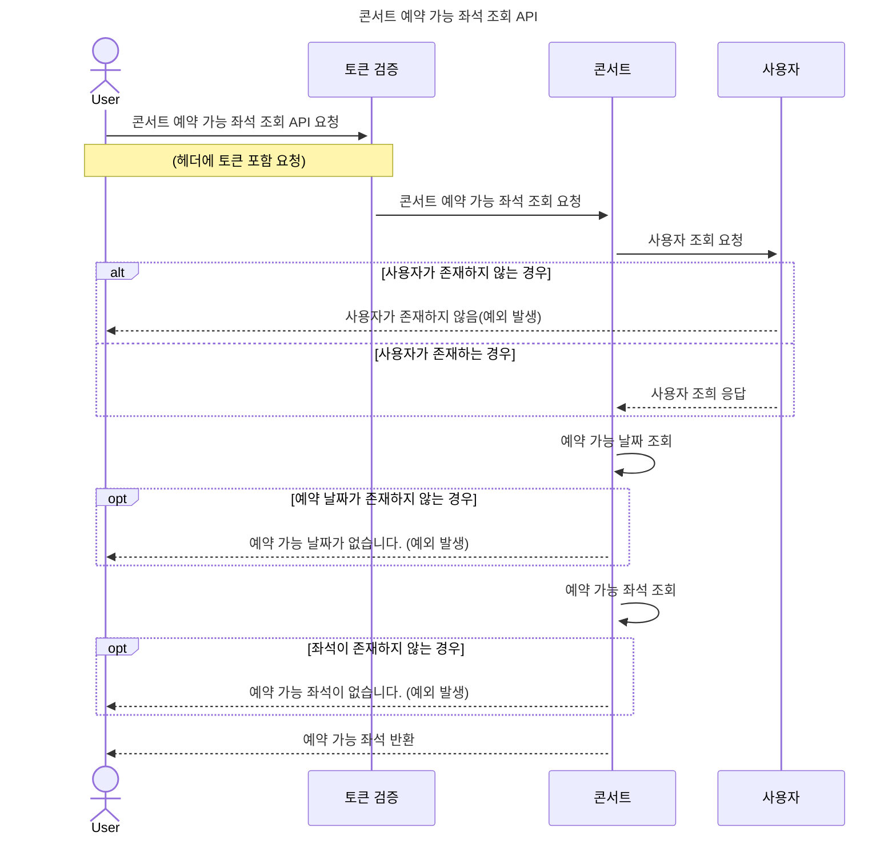
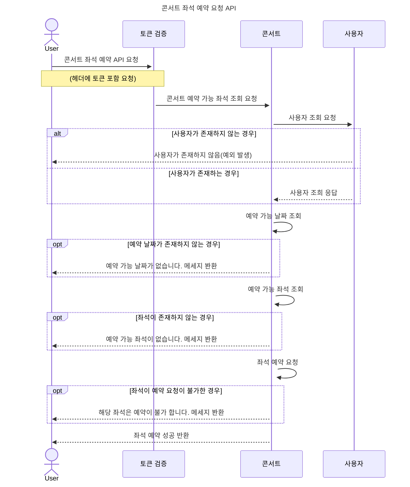
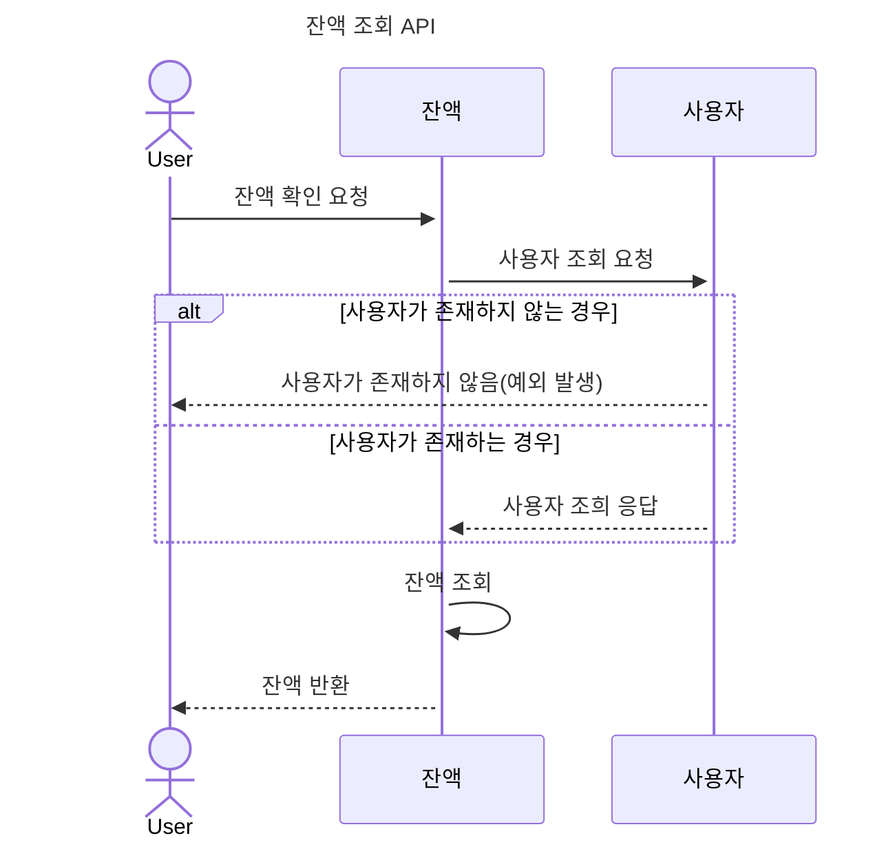
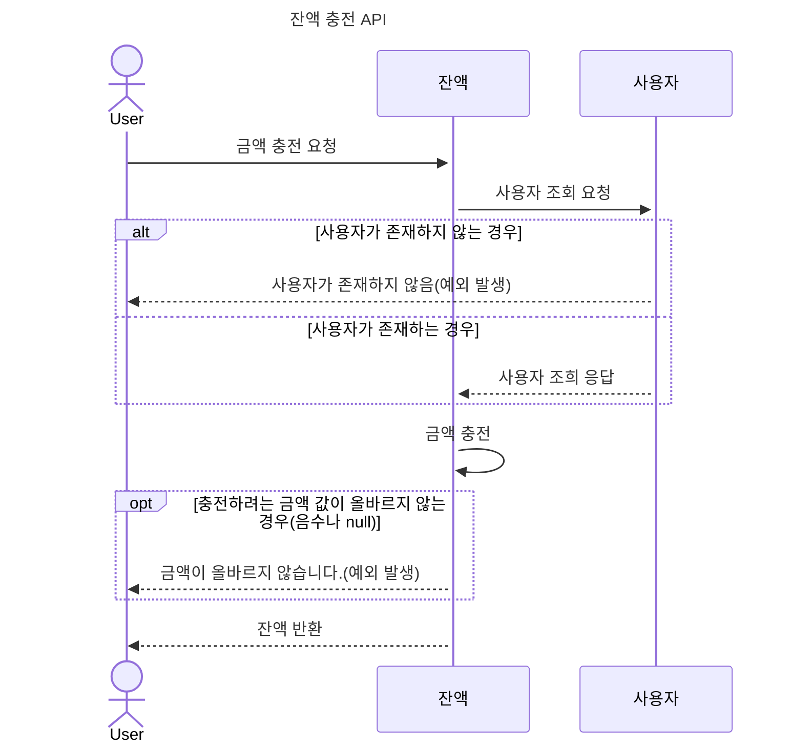
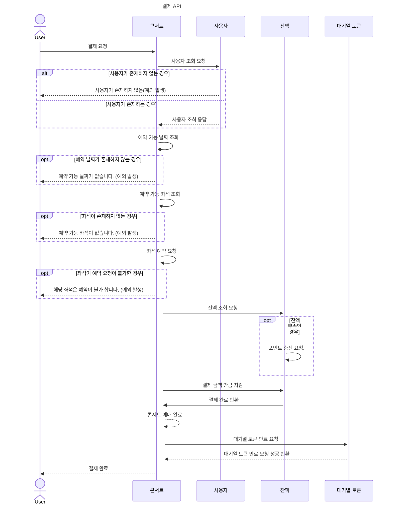
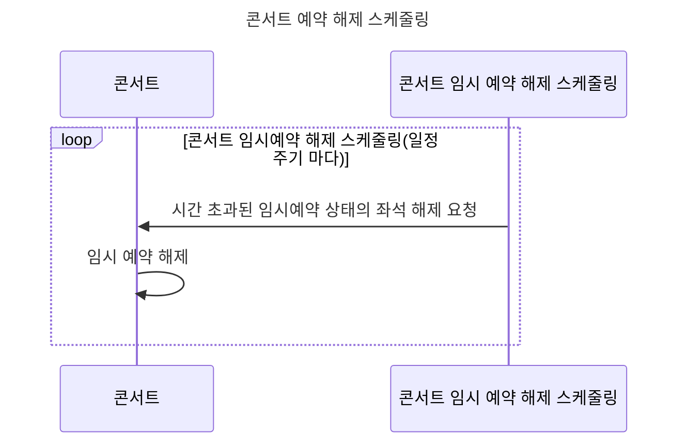
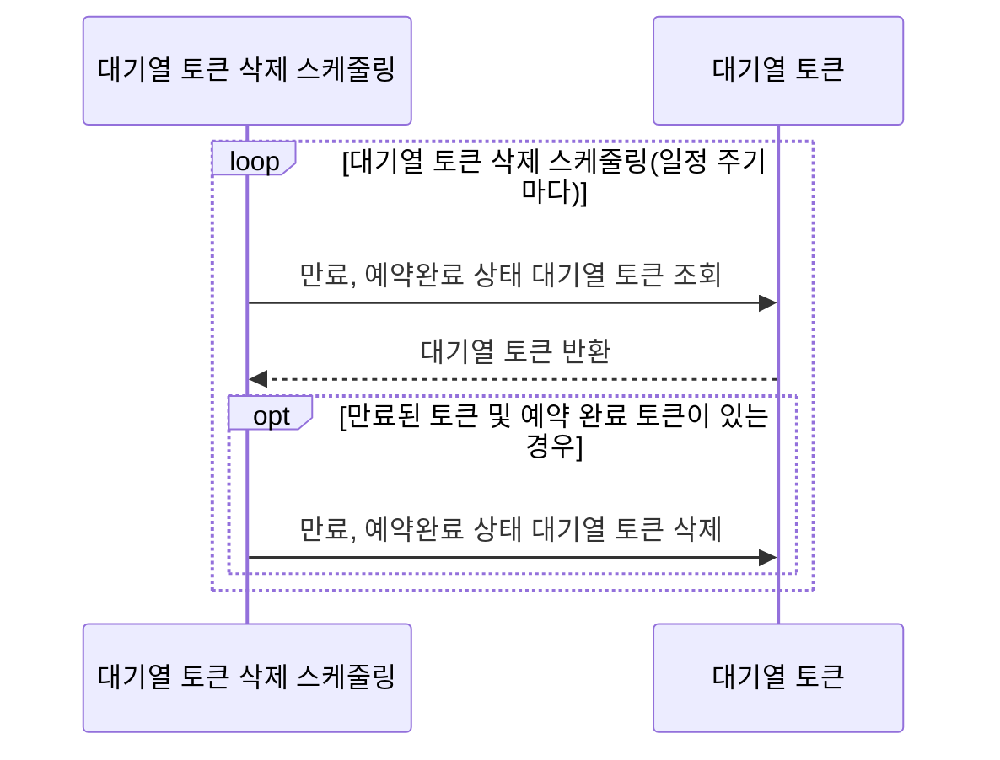

# SEQUENCE DIAGRAM

## 콘서트 예약 시퀀스 다이어그램

### 유저 대기열 토큰 기능

### 콘서트 예약 가능 날짜 조회

### 콘서트 예약 가능 좌석 조회

### 콘서트 좌석 예약 요청

### 잔액 조회

### 잔액 충전

### 결제

### 콘서트 임시예약 해제 스케줄링

### 만료된 토큰 및 예약 완료 토큰 삭제 스케줄링

